# Tomcat

# 1 Tomcat

## 1.1 Tomcat介绍

### 1.1.1 关于服务器

服务器的概念非常的广泛，它可以指代一台特殊的计算机（相比普通计算机运行更快、负载更高、价格更贵），也可以指代用于部署网站的应用。我们这里说的服务器，其实是web服务器，或者应用服务器。它本质就是一个软件，一个应用。作用就是发布我们的应用（工程），让用户可以通过浏览器访问我们的应用。

常见的应用服务器，请看下表：

| 服务器名称  | 说明                                                  |
| ----------- | ----------------------------------------------------- |
| weblogic    | 实现了javaEE规范，重量级服务器，又称为javaEE容器      |
| websphereAS | 实现了javaEE规范，重量级服务器。                      |
| JBOSSAS     | 实现了JavaEE规范，重量级服务器。免费的。              |
| Tomcat      | 实现了jsp/servlet规范，是一个轻量级服务器，开源免费。 |

### 1.1.2 Tomcat下载与安装

[Tomcat官网下载地址](http://tomcat.apache.org/)

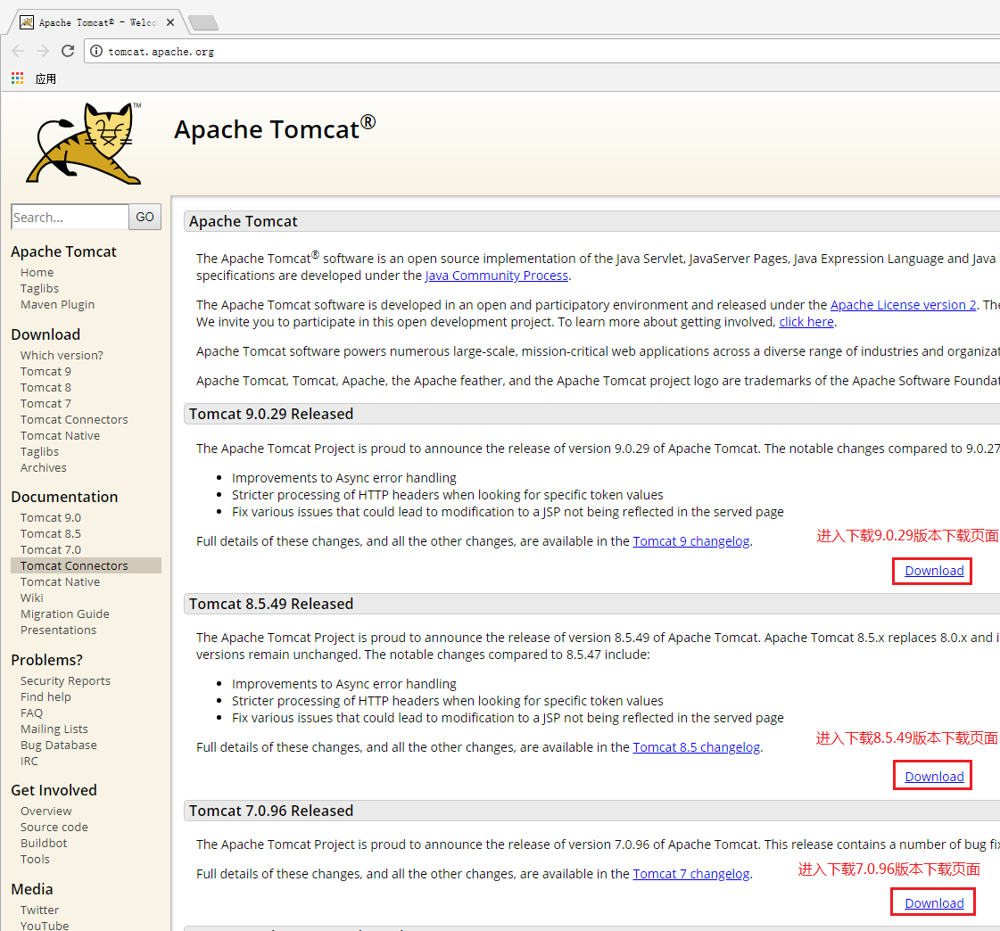

### 1.1.3 Tomcat各版本所需支持

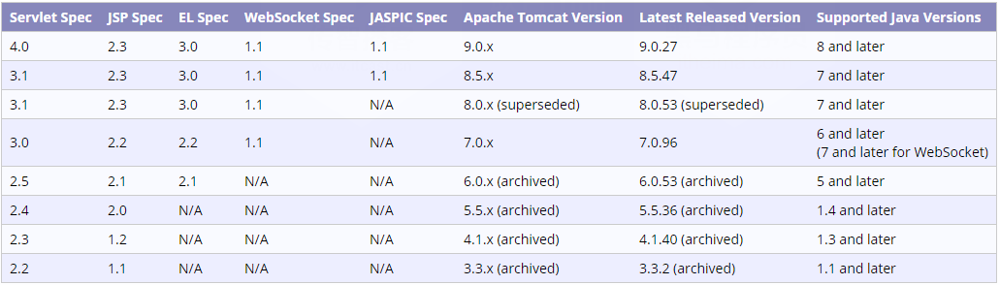

### 1.1.4 Tomcat目录结构详解

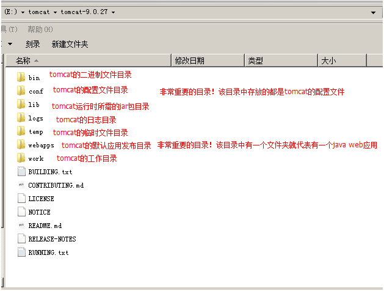

## 2.2 Tomcat基本使用

### 2.2.1 Tomcat启动和停止及问题分析解决

#### 1）启动和停止

Tomcat服务器的启动文件在二进制文件目录中：，这两个文件就是Tomcat的启动文件。

Tomcat服务器的停止文件也在二进制文件目录中：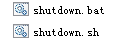，这两个文件就是Tomcat的停止文件。

其中`.bat`文件是针对`windows`系统的运行程序，`.sh`文件是针对`linux`系统的运行程序。

#### 2）启动问题

**第一个问题：启动一闪而过**

原因：没有配置环境变量。

解决办法：配置上JAVA_HOME环境变量

**第二个：Address already in use : JVM_Bind**


原因：端口被占用

解决办法：找到占用该端口的应用

​                    进程不重要：使用cmd命令：netstat -a -o 查看pid  在任务管理器中结束占用端口的进程。

​                    进程很重要：修改自己的端口号。修改的是Tomcat目录下`\conf\server.xml`中的配置。

​			

**第三个：启动产生很多异常，但能正常启动**

原因：Tomcat中部署着很多项目，每次启动这些项目都会启动。而这些项目中有启动报异常的。

解决办法：

​			能找到报异常的项目，就把它从发布目录中移除。

​			不能确定报异常的项目，就重新解压一个新的Tomcat。

**第四个：其它问题**

例如：启动产生异常，但是不能正常启动。此时就需要解压一个新的Tomcat启动，来确定是系统问题，还是Tomcat的问题。

所以，此时就需要具体问题，具体分析，然后再对症解决。

### 2.2.2 IDEA集成Tomcat服务器

**第一步**

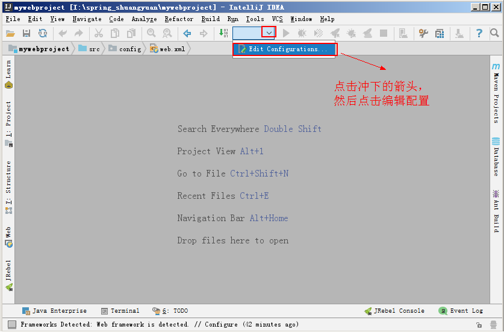

**第二步**

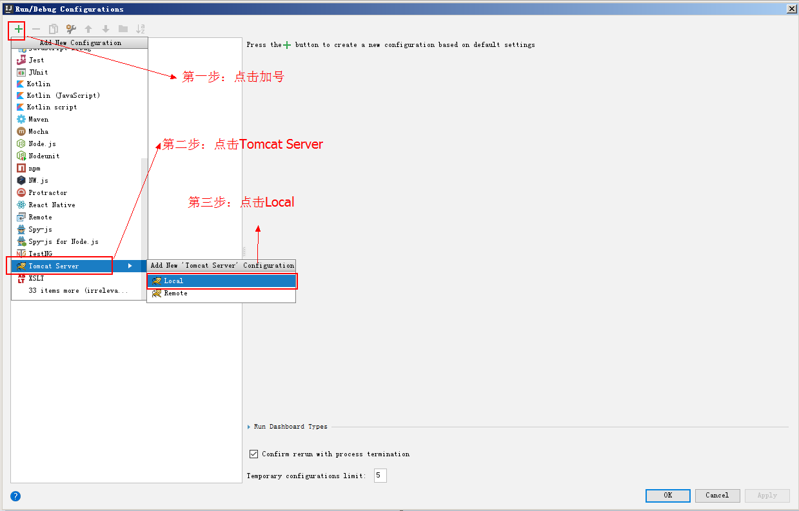

**第三步**

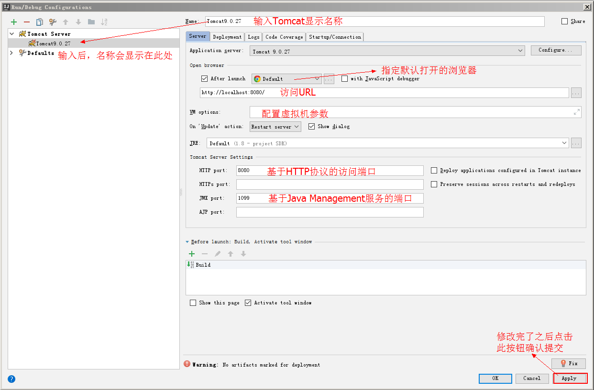

**第四步**

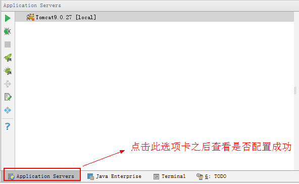

### 2.2.3 Linux系统安装Tomcat

**第一步：下载tomcat**

参考**2.1.2小节的《Tomcat下载与安装》**进入Tomcat官网，找到对应版本点击`download`进入下载页面，如下图：

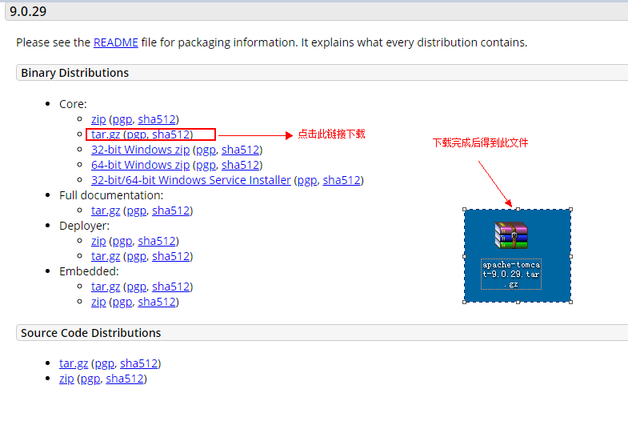

**第二步：上传到linux**

在crt上 使用 alt+p 
将windows上的软件拖进去即可(root目录)

**第三步：在 /usr/local 新建一个文件夹tomcat**

```
mkdir /usr/local/tomcat
```

**第四步：移动 tomcat...tar.gz 到 /usr/local/tomcat**

```
mv apache-tomcat-8.5.32.tar.gz /usr/local/tomcat/
```

**第五步：进入/usr/local/tomcat目录,解压Tomcat**

```
cd /usr/local/tomcat
tar -xvf apache-tomcat-8.5.32.tar.gz
```

**第六步：进入 /usr/local/tomcat/apache-tomcat-8.5.32/bin**

```
cd /usr/local/tomcat/apache-tomcat-8.5.32/bin
```

**第七步：启动tomcat**

```
方式1:
	sh startup.sh
方式2:
	./startup.sh
```

**第八步：修改防火墙的规则 **

```
方式1:service iptables stop  关闭防火墙(不建议); 用到哪一个端口号就放行哪一个(80,8080,3306...)

方式2:放行8080 端口
	修改配置文件
		cd /etc/sysconfig
		vi iptables
			复制(yy , p)	
				-A INPUT -m state --state NEW -m tcp -p tcp --dport 22 -j ACCEPT
			改成
				-A INPUT -m state --state NEW -m tcp -p tcp --dport 8080 -j ACCEPT
		重启加载防火墙或者重启防火墙
			service iptables reload  
			或者
			service iptables restart
```

## 2.3 Tomcat发布应用-JavaWeb应用

### 2.3.1 JavaWeb工程概述

`JavaWeb`应用是一个全新的应用种类。这类应用程序指供浏览器访问的程序，通常也简称为web应用。

一个web应用由多个静态web资源和动态web资源组成，例如：html、css、js文件，jsp文件、java程序、支持jar包、工程配置文件、图片、音视频等等。

Web应用开发好后，若想供外界访问，需要把web应用所在目录交给Web服务器管理（Tomcat就是Web服务器之一），这个过程称之为虚似目录的映射。

### 2.3.2 JavaWeb应用目录结构详解


```
myapp--------------应用名称
    1.html
    css/css.css
    js/demo.js
	WEB-INF--------如果有web.xml或者.class文件时，该目录必须存在，且严格区分大小写。
		   --------该目录下的资源，客户端是无法直接访问的。
           --------目录中内容如下：
        classes目录----------------web应用的class文件（加载顺序：我们的class，lib目录中的jar包，tomcat的lib目录中的jar包。优先级依次降低）
        lib目录--------------------web应用所需的jar包（tomcat的lib目录下jar为所有应用共享）
        web.xml-------------------web应用的主配置文件
```

### 2.3.3 JavaWeb应用的创建

**第一步**

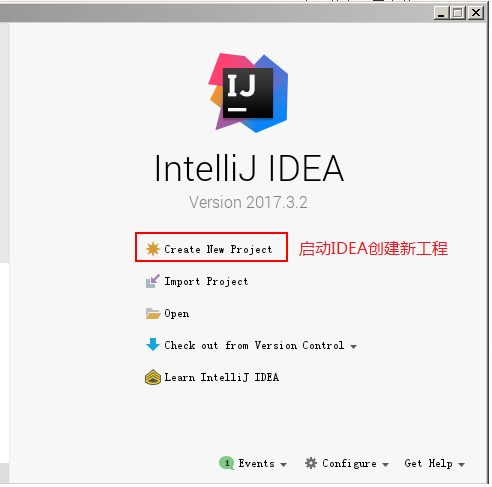

**第二步**

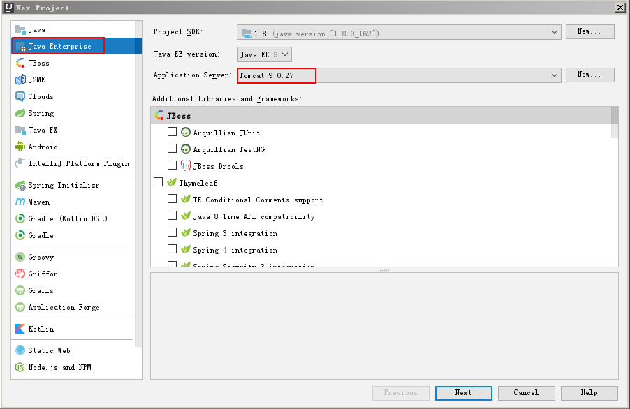

**第三步**

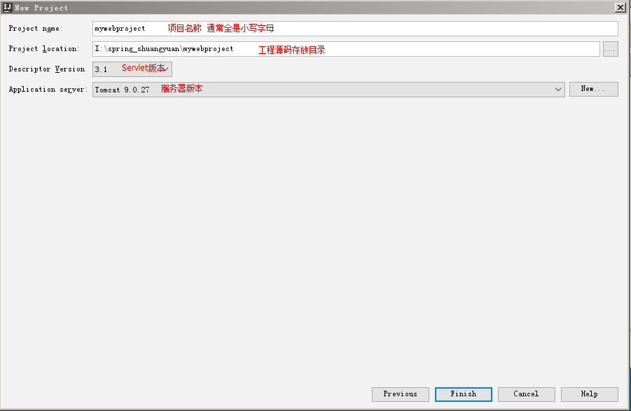

**第四步**

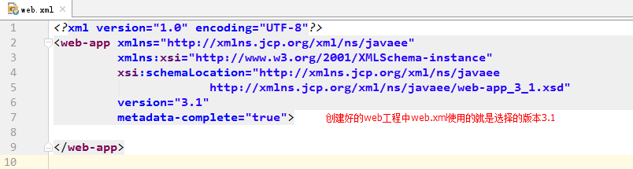

### 2.3.4 JavaWeb应用的部署

#### 1）IDEA部署

**第一步**

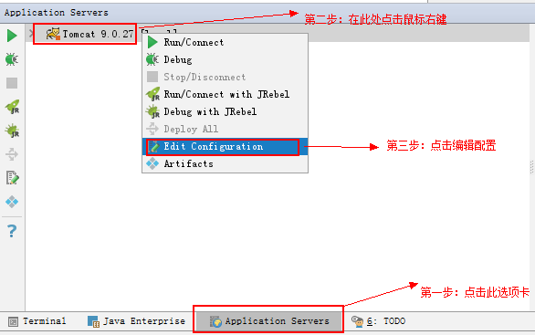

**第二步**

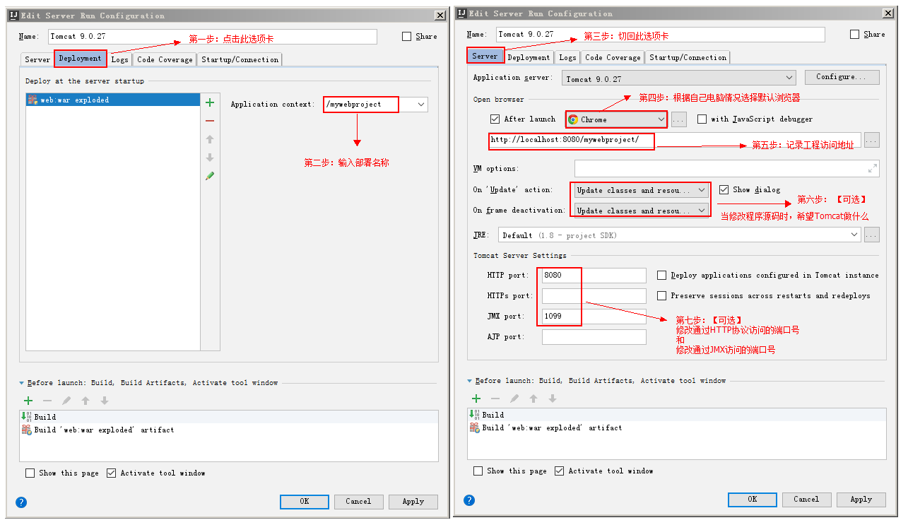

**第三步**

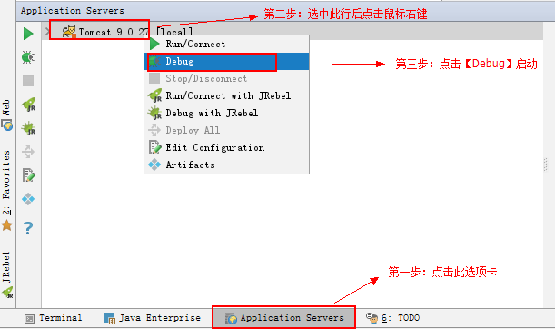

#### 2）war包发布

**第一步：使用<b>`jar -cvf war` <font color='blue'>包的名称</font>  <font color='purple'>当前目录中哪些资源要打入war</font></b>**


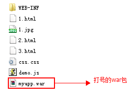

**第二步：把打好的war拷贝到tomcat的webapps目录中**

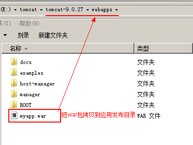

**第三步：启动服务时，tomcat会自动解压。**

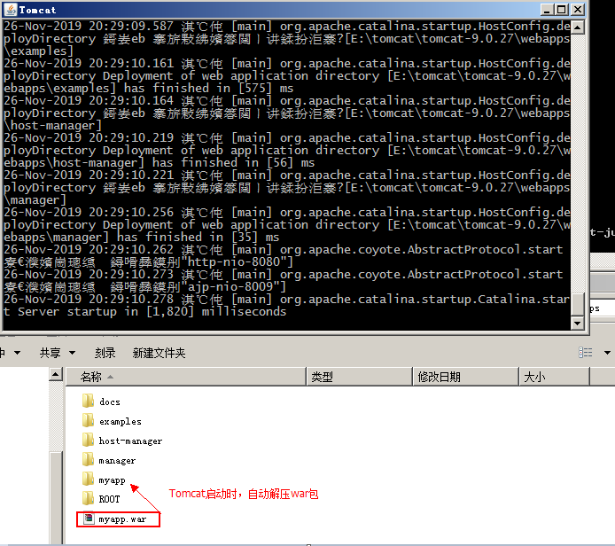

### 2.4.1 Tomcat配置虚拟目录

虚拟目录的配置，支持两种方式。第一种是通过在主配置文件中添加标签实现。第二种是通过写一个独立配置文件实现。

第一种方式：在`server.xml`的`<Host>`元素中加一个`<Context path="" docBase=""/>`元素。
​					 `path`：访问资源URI。URI名称可以随便起，但是必须在前面加上一个/
​					`docBase`：资源所在的磁盘物理地址。
第二种方式：是写一个独立的`xml`文件，该文件名可以随便起。在文件内写一个`<Context/>`元素。
​					该文件要放在Tomcat目录中的`conf\Catalina\localhost\`目录下。
需要注意的是，在使用了独立的配置文件之后，访问资源URI就变成了<b><font color='red'>/+文件的名称</font></b>。而`Context`的`path`属性就失效了。

### 2.4.2 Tomcat配置虚拟主机

在`<Engine>`元素中添加一个`<Host name="" appBase="" unparkWARs="" autoDeploy="" />`，其中：
​		`name`：指定主机的名称
​		`appBase`：当前主机的应用发布目录
​		`unparkWARs`：启动时是否自动解压war包
​		`autoDeploy`：是否自动发布

配置示例如下：

```xml
<Host name="www.itcast.cn" appBase="D:\itcastapps" unpackWARs="true" autoDeploy="true"/>

<Host name="www.itheima.com" appBase="D:\itheimaapps" unpackWARs="true" autoDeploy="true"/>
```

### 2.4.3 Tomcat默认项配置

**配置默认端口**

Tomcat服务器主配置文件中配置着访问端口，它在配置文件中写的值是：8080。但是它不是Tomcat的默认端口。我们此处说的默认端口是，当使用默认值的时候，端口号可以省略。Tomcat的默认端口是<b><font color='red'>80</font></b>。

配置方式如下：

```xml
<Connector port="80" protocol="HTTP/1.1" connectionTimeout="20000" redirectPort="8443" />		
```

**配置默认应用**

有两种方式配置默认应用。
第一种：把要作为默认应用的应用，名称改为`ROOT`。放到`webapps`目录中。

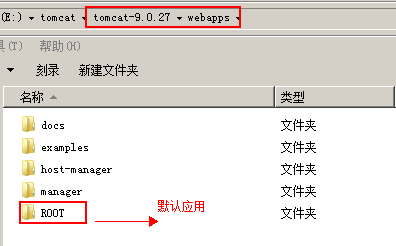

第二种：写一个独立的配置文件，文件名称为`ROOT.xml`。
​				注意：`ROOT`必须大写。当使用了独立的`ROOT.xml`文件时，`webapps`下`ROOT`应用就不是默认应用了。

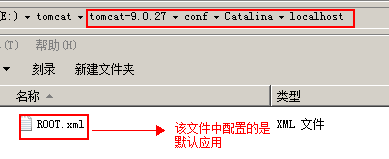

**配置默认主页**

首先要明确的是，配置默认主页是针对应用说的。是应用的默认主页。
在应用的web.xml中配置：

```xml
<welcome-file-list>
    <welcome-file>默认主页</welcome-file>
</welcome-file-list>
```

例如：

```xml
<welcome-file-list>
    <welcome-file>index.html</welcome-file>
    <welcome-file>index.htm</welcome-file>
    <welcome-file>index.jsp</welcome-file>
</welcome-file-list>
```

