# 4 综合案例-Tomcat的具体应用

## 4.1 静态资源案例-门户类网站的部署和访问

### 4.1.1 案例介绍

**需求：**

​		在浏览器中输入地址，访问静态HTML页面。

**细节说明：**

​		把`HTML`和`CSS`课程中制作的页面加入到`JavaWeb`工程中，在Tomcat中部署工程，然后启动Tomcat服务器，并使用浏览器访问。

### 4.1.2 实现步骤

**第一步：创建工程并选择使用的Tomcat版本**

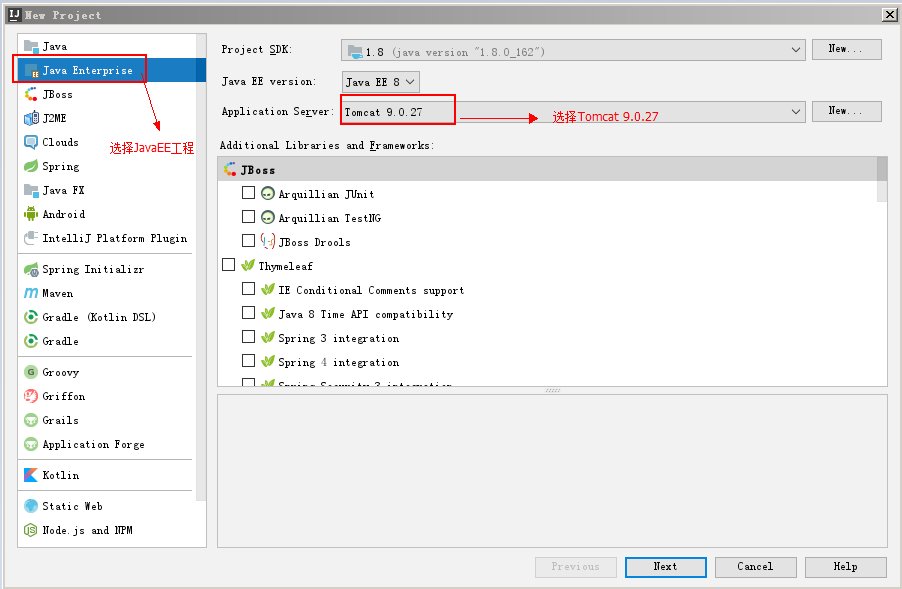

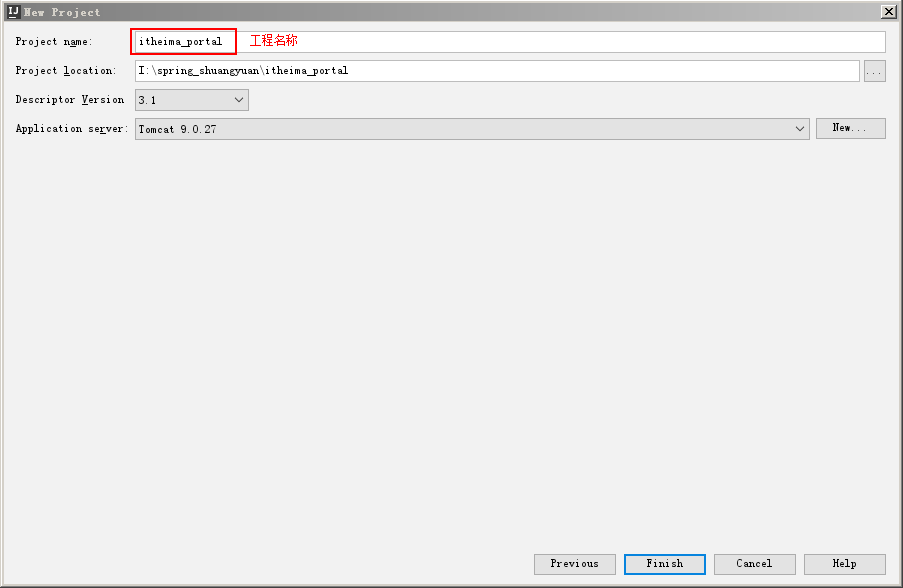

**第二步：拷贝资源到工程的web目录中**

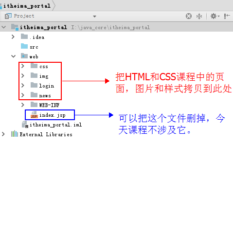

**第三步：在web.xml中配置默认主页**

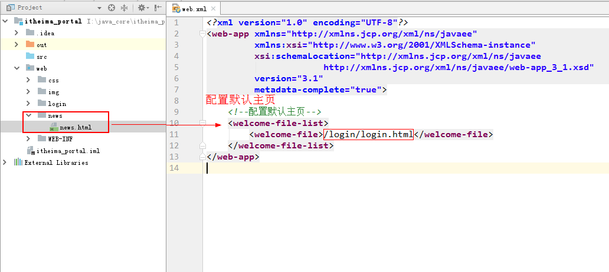

**第四步：部署工程到Tomcat服务器**


**第五步：测试浏览器访问**

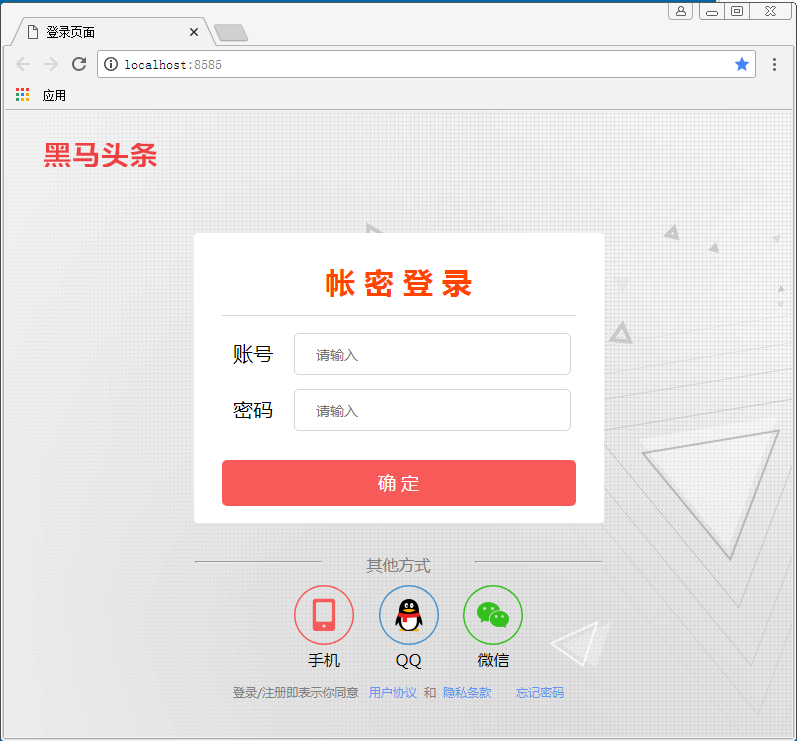

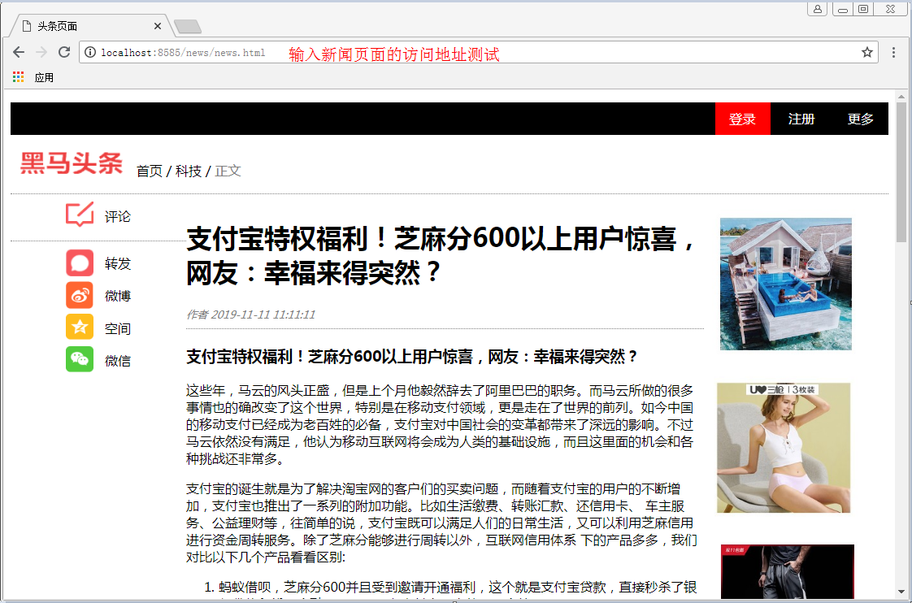

## 4.2 动态资源的案例-学生管理系统的部署和访问

### 4.2.1 案例介绍

**需求：**

​		把JavaSE进阶阶段的学生管理系统的服务器改用Tomcat实现。

**细节说明：**

​		把学生管理系统涉及的HTML和样式以及图片文件拷贝到JavaWeb工程中，在Tomcat中部署工程，然后启动Tomcat服务器，并使用浏览器访问。

### 4.2.2 实现步骤

**第一步：创建工程**


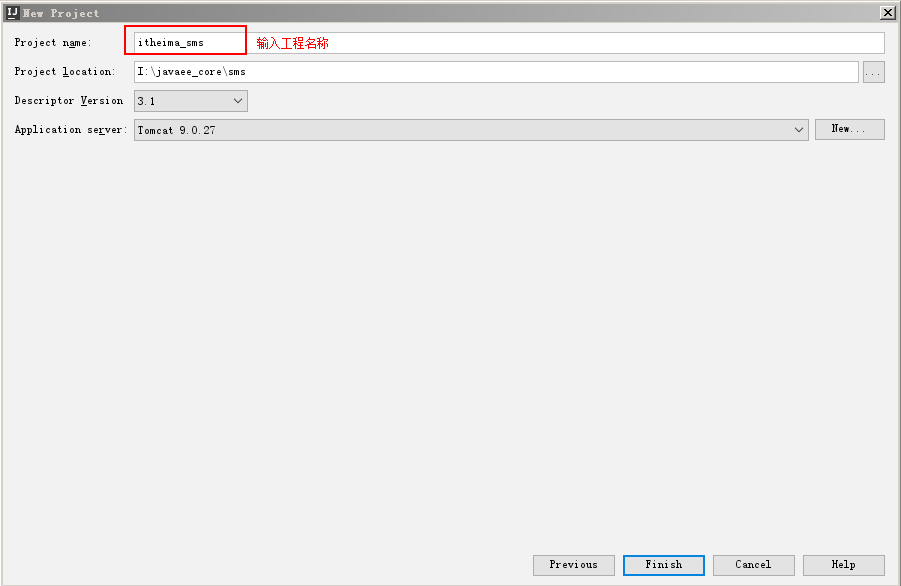

**第二步：拷贝资源**

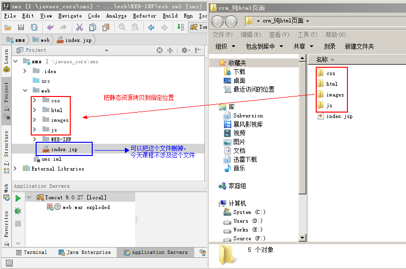

**第三步：配置默认主页**

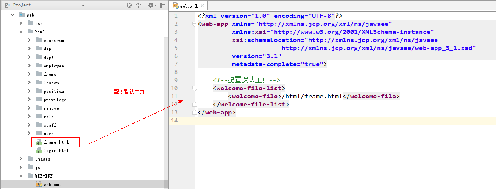

**第四步：部署项目**

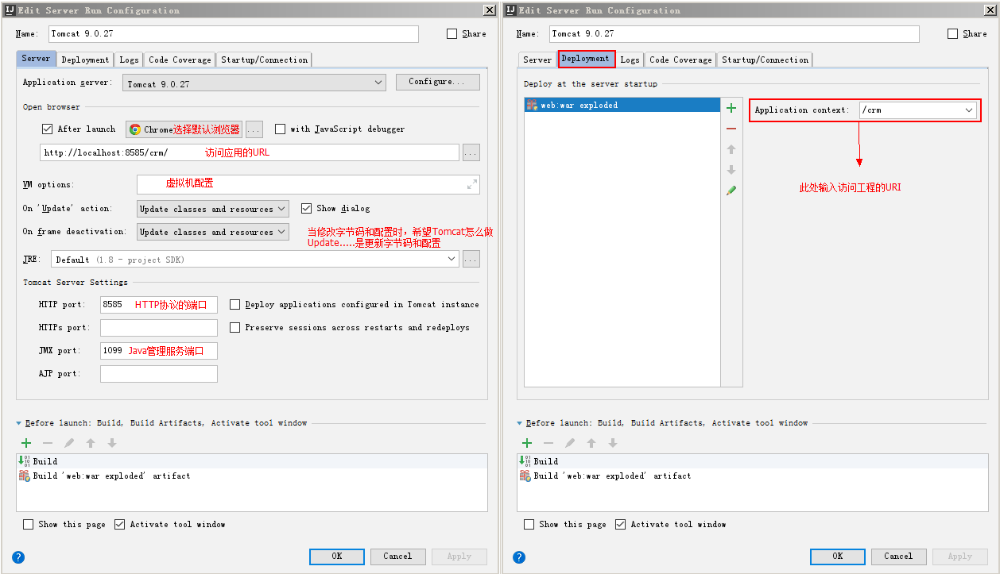

### 4.3.2 创建案例中的动态资源-Servlet

#### 1） Servlet简介

Servlet翻译成中文是服务端脚本，它是SUN公司推出的一套规范，称为Servlet规范。Servlet规范是JavaEE规范中的一部分。我们可以通过查阅JavaEE规范的API来了解Servlet的基本概念。通过点击[JavaEE8官方文档](https://javaee.github.io/javaee-spec/javadocs/)，就可以看到关于Servlet的内容介绍。

#### 2） 按步骤编写Servlet

**前期准备：在IDEA创建Javaweb工程**

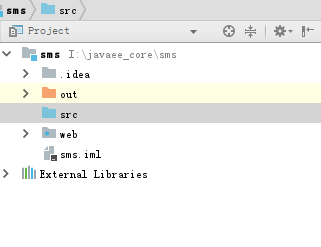

**第一步：编写一个普通类实现Servlet接口或者继承GenericServlet类或者继承HttpServlet**

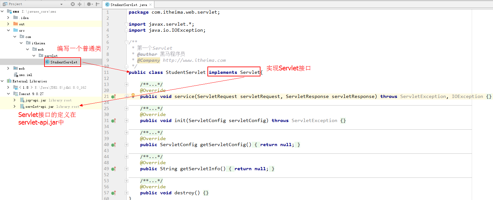

**第二步：重写service方法，输出一句话**

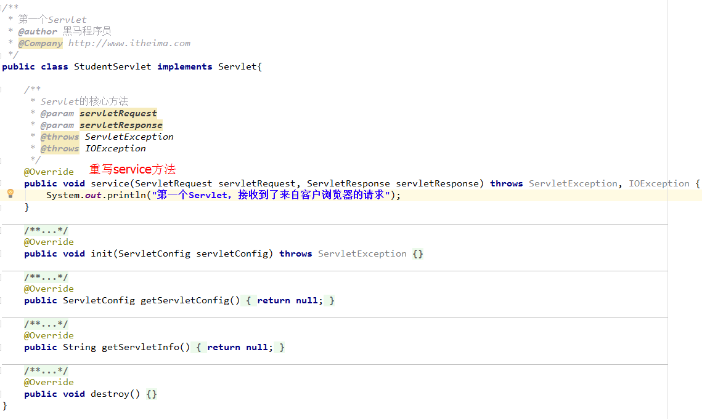

**第三步：在web.xml配置Servlet**

```
 <!--配置Servlet-->
    <servlet>
        <servlet-name>studentServlet</servlet-name>
        <servlet-class>com.itheima.servlet.StudentServlet</servlet-class>
    </servlet>

    <!--配置Servlet映射-->
    <servlet-mapping>
        <servlet-name>studentServlet</servlet-name>
        <url-pattern>/studentServlet</url-pattern>
    </servlet-mapping>
```

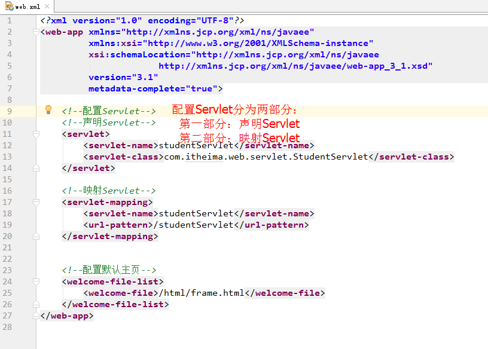

**第四步：启动tomcat服务器测试**

在地址栏输入：http://localhost:8585/crm/studentServlet 测试访问结果 

#### 3）测试访问

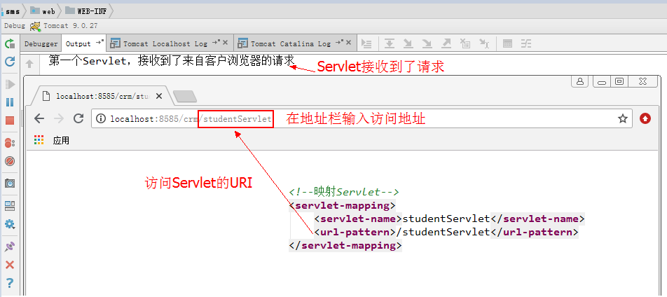