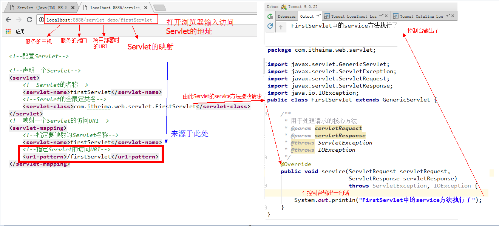
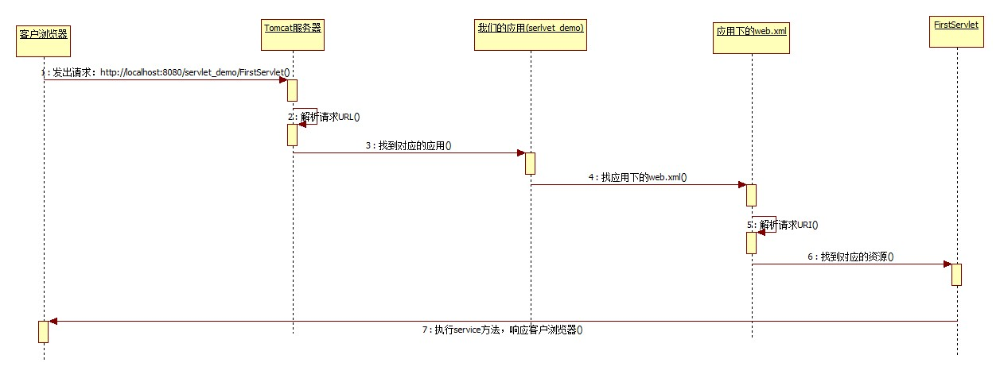
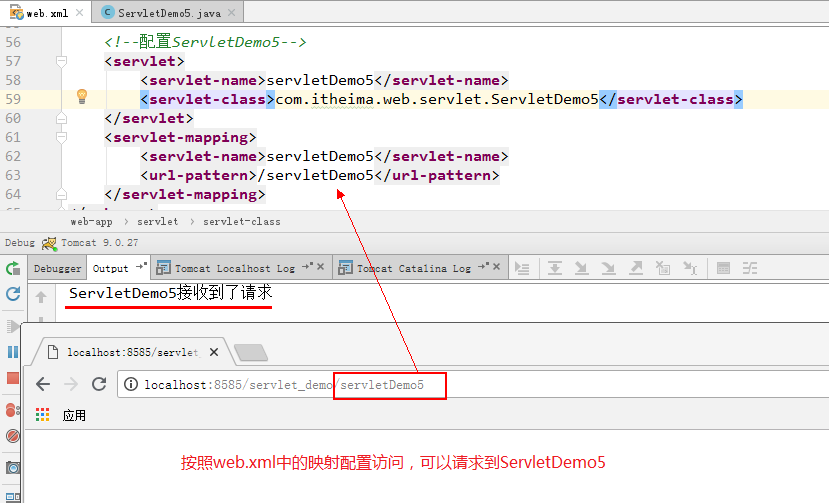

# 1 Servlet

## 1.1 Servlet概述

Servlet是SUN公司提供的一套规范，名称就叫Servlet规范，它也是JavaEE规范之一。


第一：Servlet是一个运行在web服务端的java小程序

第二：它可以用于接收和响应客户端的请求

第三：要想实现Servlet功能，可以实现Servlet接口，继承GenericServlet或者HttpServlet

第四：每次请求都会执行service方法

第五：Servlet还支持配置


## 1.2 Servlet入门

### Servlet

#### 1） Servlet简介

Servlet翻译成中文是服务端脚本，它是SUN公司推出的一套规范，称为Servlet规范。Servlet规范是JavaEE规范中的一部分。我们可以通过查阅JavaEE规范的API来了解Servlet的基本概念。通过点击[JavaEE8官方文档](https://javaee.github.io/javaee-spec/javadocs/)，就可以看到关于Servlet的内容介绍。

#### 2） 按步骤编写Servlet

**前期准备：在IDEA创建Javaweb工程**


**第一步：编写一个普通类实现Servlet接口或者继承GenericServlet类或者继承HttpServlet**


**第二步：重写service方法，输出一句话**


**第三步：在web.xml配置Servlet**


**第四步：启动tomcat服务器测试**

在地址栏输入：http://localhost:8585/crm/studentServlet 测试访问结果 


### 1.2.1 Servlet编码步骤

#### 1）编码步骤

**第一步：前期准备-创建JavaWeb工程**

**第二步：编写一个普通类继承GenericServlet并重写service方法**

**第三步：在web.xml配置Servlet**

#### 2）测试

**在Tomcat中部署项目**

**在浏览器访问Servlet**



### 1.2.2 Servlet执行过程分析

我们通过浏览器发送请求，请求首先到达Tomcat服务器，由服务器解析请求URL，然后在部署的应用列表中找到我们的应用。接下来，在我们的应用中找应用里的web.xml配置文件，在web.xml中找到FirstServlet的配置，找到后执行service方法，最后由FirstServlet响应客户浏览器。整个过程如下图所示：



一句话总结执行过程：

浏览器——>Tomcat服务器——>我们的应用——>应用中的web.xml——>FirstServlet——>响应浏览器

### 1.2.3 Servlet类视图

在《Tomcat和Http协议》这天课程和刚才的入门案例中，我们都定义了自己的Servlet，实现的方式都是选择继承GenericServlet，在Servlet的API介绍中，它提出了我们除了继承GenericServlet外还可以继承HttpServlet，通过查阅servlet的类视图，我们看到GenericServlet还有一个子类HttpServlet。同时，在service方法中还有参数ServletRequest和ServletResponse，它们的关系如下图所示：


### 1.2.4 Servlet编写方式

#### 1）编写方式说明

我们在实现Servlet功能时，可以选择以下三种方式：

第一种：实现Servlet接口，接口中的方法必须全部实现。

​			  使用此种方式，表示接口中的所有方法在需求方面都有重写的必要。此种方式支持最大程度的自定义。

第二种：继承GenericServlet，service方法必须重写，其他方可根据需求，选择性重写。

​			  使用此种方式，表示只在接收和响应客户端请求这方面有重写的需求，而其他方法可根据实际需求选择性重写，使我们的开发Servlet变得简单。但是，此种方式是和HTTP协议无关的。

第三种：继承HttpServlet，它是javax.servlet.http包下的一个抽象类，是GenericServlet的子类。<b><font color='red'>如果我们选择继承HttpServlet时，只需要重写doGet和doPost方法，不要覆盖service方法。</font></b>

​				使用此种方式，表示我们的请求和响应需要和HTTP协议相关。也就是说，我们是通过HTTP协议来访问的。那么每次请求和响应都符合HTTP协议的规范。请求的方式就是HTTP协议所支持的方式（目前我们只知道GET和POST，而实际HTTP协议支持7种请求方式，GET POST PUT DELETE TRACE OPTIONS HEAD )。

#### 2）HttpServlet的使用细节

**第一步：在入门案例的工程中创建一个Servlet继承HttpServlet**

<font color='red'>注意：不要重写任何方法</font>，如下图所示：


**第二步：部署项目并测试访问**

当我们在地址栏输入ServletDemo2的访问URL时，出现了访问错误，状态码是405。提示信息是：方法不允许。

**第三步：分析原因** 

得出HttpServlet的使用结论：

​	 <b><font color='red'>我们继承了HttpServlet，需要重写里面的doGet和doPost方法来接收get方式和post方式的请求。</font></b>

为了实现代码的可重用性，我们只需要在doGet或者doPost方法中一个里面提供具体功能即可，而另外的那个方法只需要调用提供了功能的方法。

```
package com.itheima.servlet;

import javax.servlet.ServletException;
import javax.servlet.http.HttpServlet;
import javax.servlet.http.HttpServletRequest;
import javax.servlet.http.HttpServletResponse;
import java.io.IOException;

public class ServletDemo2 extends HttpServlet {
    @Override
    protected void doGet(HttpServletRequest req, HttpServletResponse resp) throws ServletException, IOException {
        System.out.println("方法执行了");

    }

    @Override
    protected void doPost(HttpServletRequest req, HttpServletResponse resp) throws ServletException, IOException {
        doPost(req, resp);
    }
}

```

第四步：配置web.xml文件

```
<!DOCTYPE web-app PUBLIC
 "-//Sun Microsystems, Inc.//DTD Web Application 2.3//EN"
 "http://java.sun.com/dtd/web-app_2_3.dtd" >

<web-app>
  <display-name>Archetype Created Web Application</display-name>
  <welcome-file-list>
    <welcome-file>/html/frame.html</welcome-file>
  </welcome-file-list>

  <!--配置Servlet-->
  <servlet>
    <servlet-name>servletDemo2</servlet-name>
    <servlet-class>com.itheima.servlet.ServletDemo2</servlet-class>
  </servlet>

  <!--配置Servlet映射-->
  <servlet-mapping>
    <servlet-name>servletDemo2</servlet-name>
    <url-pattern>/servletDemo2</url-pattern>
  </servlet-mapping>
</web-app>

```

第五步：验证

启动tomcat，访问页面，查看控制台输出


## 1.3 Servlet使用细节

### 1.3.1 Servlet的生命周期

对象的生命周期，就是对象从生到死的过程，即：出生——活着——死亡。用更偏向 于开发的官方说法就是对象创建到销毁的过程。

出生：请求第一次到达Servlet时，对象就创建出来，并且初始化成功。只出生一次，就放到内存中。

活着：服务器提供服务的整个过程中，该对象一直存在，每次只是执行service方法。

死亡：当服务停止时，或者服务器宕机时，对象消亡。

通过分析Servlet的生命周期我们发现，它的实例化和初始化只会在请求第一次到达Servlet时执行，而销毁只会在Tomcat服务器停止时执行，由此我们得出一个结论，Servlet对象只会创建一次，销毁一次。所以，Servlet对象只有一个实例。如果一个对象实例在应用中是唯一的存在，那么我们就说它是单实例的，即运用了单例模式。

### 1.3.2 Servlet的线程安全

由于Servlet运用了单例模式，即整个应用中只有一个实例对象，所以我们需要分析这个唯一的实例中的类成员是否线程安全。接下来，我们来看下面的的示例：

```java
/*
    Servlet线程安全
 */
public class ServletDemo04 extends HttpServlet{
    //1.定义用户名成员变量
    //private String username = null;

    @Override
    protected void doGet(HttpServletRequest req, HttpServletResponse resp) throws ServletException, IOException {
        String username = null;
        //synchronized (this) {
            //2.获取用户名
            username = req.getParameter("username");

            try {
                Thread.sleep(3000);
            } catch (InterruptedException e) {
                e.printStackTrace();
            }

            //3.获取输出流对象
            PrintWriter pw = resp.getWriter();

            //4.响应给客户端浏览器
            pw.print("welcome:" + username);

            //5.关流
            pw.close();
        //}
    }

    @Override
    protected void doPost(HttpServletRequest req, HttpServletResponse resp) throws ServletException, IOException {
        doGet(req,resp);
    }
}
```

启动两个浏览器，输入不同的参数，访问之后发现输出的结果都是一样，所以出现线程安全问题


通过上面的测试我们发现，在Servlet中定义了类成员之后，多个浏览器都会共享类成员的数据。其实每一个浏览器端发送请求，就代表是一个线程，那么多个浏览器就是多个线程，所以测试的结果说明了多个线程会共享Servlet类成员中的数据，其中任何一个线程修改了数据，都会影响其他线程。因此，我们可以认为Servlet它不是线程安全的。

分析产生这个问题的根本原因，其实就是因为Servlet是单例，单例对象的类成员只会随类实例化时初始化一次，之后的操作都是改变，而不会重新初始化。

解决这个问题也非常简单，就是在Servlet中定义类成员要慎重。如果类成员是共用的，并且只会在初始化时赋值，其余时间都是获取的话，那么是没问题。如果类成员并非共用，或者每次使用都有可能对其赋值，那么就要考虑线程安全问题了，把它定义到doGet或者doPost方法里面去就可以了。

### 1.3.3 Servlet的注意事项

#### 1）映射Servlet的细节

Servlet支持三种映射方式，以达到灵活配置的目的。

首先编写一个Servlet，代码如下：

```java
/**
 * 演示Servlet的映射方式
 * @author 黑马程序员
 * @Company http://www.itheima.com
 */
public class ServletDemo5 extends HttpServlet {

    /**
     * doGet方法输出一句话
     * @param req
     * @param resp
     * @throws ServletException
     * @throws IOException
     */
    @Override
    protected void doGet(HttpServletRequest req, HttpServletResponse resp) throws ServletException, IOException {
        System.out.println("ServletDemo5接收到了请求");
    }

    /**
     * 调用doGet方法
     * @param req
     * @param resp
     * @throws ServletException
     * @throws IOException
     */
    @Override
    protected void doPost(HttpServletRequest req, HttpServletResponse resp) throws ServletException, IOException {
        doGet(req,resp);
    }
}
```

**第一种：指名道姓的方式**

​			   此种方式，只有和映射配置一模一样时，Servlet才会接收和响应来自客户端的请求。

​			   例如：映射为：/servletDemo5

​						   访问URL：http://localhost:8585/servlet_demo/servletDemo5



**第二种：/开头+通配符的方式**

​			   此种方式，只要符合目录结构即可，不用考虑结尾是什么。

​				例如：映射为：/servlet/*

​							访问URL：http://localhost:8585/servlet/itheima

​											   http://localhost:8585/servlet/itcast.do

​							这两个URL都可以。因为用的*，表示/servlet/后面的内容是什么都可以。


**第三种：通配符+固定格式结尾**

​				此种方式，只要符合固定结尾格式即可，其前面的访问URI无须关心（注意协议，主机和端口必须正确）

​				例如：映射为：*.do

​							访问URL：http://localhost:8585/servlet/itcast.do

​												http://localhost:8585/itheima.do

​							这两个URL都可以方法。因为都是以.do作为结尾，而前面用*号通配符配置的映射，所有无须关心。


通过测试我们发现，Servlet支持多种配置方式，但是由此也引出了一个问题，当有两个及以上的Servlet映射都符合请求URL时，由谁来响应呢？注意：HTTP协议的特征是一请求一响应的规则。那么有一个请求，必然有且只有一个响应。所以，我们接下来明确一下，多种映射规则的优先级。

先说结论：指名道姓的方式优先级最高，带有通配符的映射方式，有/的比没/的优先级高

所以，我们前面讲解的三种映射方式的优先级为：第一种>第二种>第三种。

演示代码如下：

```java
/**
 * 它和ServletDemo5组合演示Servlet的访问优先级问题
 * @author 黑马程序员
 * @Company http://www.itheima.com
 */
public class ServletDemo6 extends HttpServlet {

    /**
     * doGet方法输出一句话
     * @param req
     * @param resp
     * @throws ServletException
     * @throws IOException
     */
    @Override
    protected void doGet(HttpServletRequest req, HttpServletResponse resp) throws ServletException, IOException {
        System.out.println("ServletDemo6接收到了请求");
    }

    /**
     * 调用doGet方法
     * @param req
     * @param resp
     * @throws ServletException
     * @throws IOException
     */
    @Override
    protected void doPost(HttpServletRequest req, HttpServletResponse resp) throws ServletException, IOException {
        doGet(req,resp);
    }
}
```

```xml
<!--配置ServletDemo6-->
<servlet>
    <servlet-name>servletDemo6</servlet-name>
    <servlet-class>com.itheima.web.servlet.ServletDemo6</servlet-class>
</servlet>
<servlet-mapping>
    <servlet-name>servletDemo6</servlet-name>
    <url-pattern>/*</url-pattern>
</servlet-mapping>
```

运行结果如下：


#### 2）多路径映射Servlet

上一小节我们讲解了Servlet的多种映射方式，这一小节我们来介绍一下，一个Servlet的多种路径配置的支持。

它其实就是给一个Servlet配置多个访问映射，从而可以根据不同请求URL实现不同的功能。

首先，创建一个Servlet：

```java
/**
 * 演示Servlet的多路径映射
 * @author 黑马程序员
 * @Company http://www.itheima.com
 */
public class ServletDemo7 extends HttpServlet {

    /**
     * 根据不同的请求URL，做不同的处理规则
     * @param req
     * @param resp
     * @throws ServletException
     * @throws IOException
     */
    @Override
    protected void doGet(HttpServletRequest req, HttpServletResponse resp) throws ServletException, IOException {
        //1.获取当前请求的URI
        String uri = req.getRequestURI();
        uri = uri.substring(uri.lastIndexOf("/"),uri.length());
        //2.判断是1号请求还是2号请求
        if("/servletDemo7".equals(uri)){
            System.out.println("ServletDemo7执行1号请求的业务逻辑：商品单价7折显示");
        }else if("/demo7".equals(uri)){
            System.out.println("ServletDemo7执行2号请求的业务逻辑：商品单价8折显示");
        }else {
            System.out.println("ServletDemo7执行基本业务逻辑：商品单价原价显示");
        }
    }

    /**
     * 调用doGet方法
     * @param req
     * @param resp
     * @throws ServletException
     * @throws IOException
     */
    @Override
    protected void doPost(HttpServletRequest req, HttpServletResponse resp) throws ServletException, IOException {
        doGet(req,resp);
    }
}
```

接下来，在web.xml配置Servlet：

```xml
<!--配置ServletDemo7-->
<servlet>
    <servlet-name>servletDemo7</servlet-name>
    <servlet-class>com.itheima.web.servlet.ServletDemo7</servlet-class>
</servlet>
<!--映射路径1-->
<servlet-mapping>
    <servlet-name>servletDemo7</servlet-name>
    <url-pattern>/demo7</url-pattern>
</servlet-mapping>
<!--映射路径2-->
<servlet-mapping>
    <servlet-name>servletDemo7</servlet-name>
    <url-pattern>/servletDemo7</url-pattern>
</servlet-mapping>
<!--映射路径3-->
<servlet-mapping>
    <servlet-name>servletDemo7</servlet-name>
    <url-pattern>/servlet/*</url-pattern>
</servlet-mapping>
```

最后，启动服务测试运行结果：


#### 3）启动时创建Servlet

我们前面讲解了Servlet的生命周期，Servlet的创建默认情况下是请求第一次到达Servlet时创建的。但是我们都知道，Servlet是单例的，也就是说在应用中只有唯一的一个实例，所以在Tomcat启动加载应用的时候就创建也是一个很好的选择。那么两者有什么区别呢？

- 第一种：应用加载时创建Servlet，它的优势是在服务器启动时，就把需要的对象都创建完成了，从而在使用的时候减少了创建对象的时间，提高了首次执行的效率。它的弊端也同样明显，因为在应用加载时就创建了Servlet对象，因此，导致内存中充斥着大量用不上的Servlet对象，造成了内存的浪费。
- 第二种：请求第一次访问是创建Servlet，它的优势就是减少了对服务器内存的浪费，因为那些一直没有被访问过的Servlet对象都没有创建，因此也提高了服务器的启动时间。而它的弊端就是，如果有一些要在应用加载时就做的初始化操作，它都没法完成，从而要考虑其他技术实现。

通过上面的描述，相信同学们都能分析得出何时采用第一种方式，何时采用第二种方式。就是当需要在应用加载就要完成一些工作时，就需要选择第一种方式。当有很多Servlet的使用时机并不确定是，就选择第二种方式。

在web.xml中是支持对Servlet的创建时机进行配置的，配置的方式如下：我们就以ServletDemo3为例。

```xml
<!--配置ServletDemo3-->
<servlet>
    <servlet-name>servletDemo3</servlet-name>
    <servlet-class>com.itheima.web.servlet.ServletDemo3</servlet-class>
    <!--配置Servlet的创建顺序，当配置此标签时，Servlet就会改为应用加载时创建
        配置项的取值只能是正整数（包括0），数值越小，表明创建的优先级越高
    -->
    <load-on-startup>1</load-on-startup>
</servlet>
<servlet-mapping>
    <servlet-name>servletDemo3</servlet-name>
    <url-pattern>/servletDemo3</url-pattern>
</servlet-mapping>
```


#### 4）默认Servlet

默认Servlet是由服务器提供的一个Servlet，它配置在Tomcat的conf目录下的web.xml中。如下图所示：


它的映射路径是<b><font color='red'>`<url-pattern>/<url-pattern>`</font></b>，我们在发送请求时，首先会在我们应用中的web.xml中查找映射配置，找到就执行，这块没有问题。但是当找不到对应的Servlet路径时，就去找默认的Servlet，由默认Servlet处理。所以，一切都是Servlet。

### 1.4 Servlet关系总图


