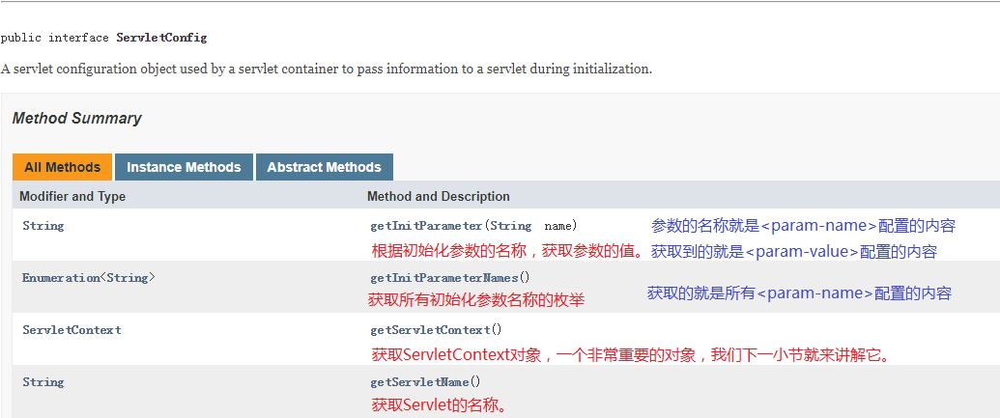
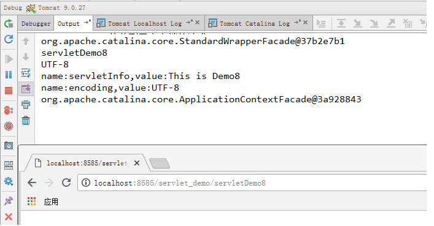

# 2 ServletConfig

## 2.1 ServletConfig概述

### 2.1.1 基本概念

它是Servlet的配置参数对象，在Servlet规范中，允许为每个Servlet都提供一些初始化配置。所以，每个Servlet都一个自己的ServletConfig。它的作用是在Servlet初始化期间，把一些配置信息传递给Servlet。

### 2.1.2 生命周期

由于它是在初始化阶段读取了web.xml中为Servlet准备的初始化配置，并把配置信息传递给Servlet，所以生命周期与Servlet相同。这里需要注意的是，如果Servlet配置了`<load-on-startup>1</load-on-startup>`，那么ServletConfig也会在应用加载时创建。

## 2.2 ServletConfig的使用

### 2.2.1 如何获取

首先，我们要清楚的认识到，它可以为每个Servlet都提供初始化参数，所以肯定可以在每个Servlet中都配置。那是配置在Servlet的声明部分，还是映射部分呢？我们接下来先准备一个Servlet，然后给同学们揭秘。

```java
/**
 * 演示Servlet的初始化参数对象
 * @author 黑马程序员
 * @Company http://www.itheima.com
 */
public class ServletDemo8 extends HttpServlet {

    //定义Servlet配置对象ServletConfig
    private ServletConfig servletConfig;

    /**
     * 在初始化时为ServletConfig赋值
     * @param config
     * @throws ServletException
     */
    @Override
    public void init(ServletConfig config) throws ServletException {
        this.servletConfig = config;
    }

    /**
     * @param req
     * @param resp
     * @throws ServletException
     * @throws IOException
     */
    @Override
    protected void doGet(HttpServletRequest req, HttpServletResponse resp) throws ServletException, IOException {
        //输出ServletConfig
        System.out.println(servletConfig);
    }

    /**
     * 调用doGet方法
     * @param req
     * @param resp
     * @throws ServletException
     * @throws IOException
     */
    @Override
    protected void doPost(HttpServletRequest req, HttpServletResponse resp) throws ServletException, IOException {
        doGet(req,resp);
    }
}
```

```xml
<!--配置ServletDemo8-->
<servlet>
    <servlet-name>servletDemo8</servlet-name>
    <servlet-class>com.itheima.web.servlet.ServletDemo8</servlet-class>
</servlet>
<servlet-mapping>
    <servlet-name>servletDemo8</servlet-name>
    <url-pattern>/servletDemo8</url-pattern>
</servlet-mapping>
```

### 2.2.2 如何配置

在上一小节中，我们已经准备好了Servlet，同时也获取到了它的ServletConfig对象，在本小节中我们将告诉同学们如何配置初始化参数，它需要使用`<servlet>`标签中的`<init-param>`标签来配置。这也就揭秘上一小节的悬念，Servlet的初始化参数都是配置在Servlet的声明部分的。并且每个Servlet都支持有多个初始化参数，并且初始化参数都是以键值对的形式存在的。接下来，我们看配置示例：

```xml
<!--配置ServletDemo8-->
<servlet>
    <servlet-name>servletDemo8</servlet-name>
    <servlet-class>com.itheima.web.servlet.ServletDemo8</servlet-class>
    <!--配置初始化参数-->
    <init-param>
        <!--用于获取初始化参数的key-->
        <param-name>encoding</param-name>
        <!--初始化参数的值-->
        <param-value>UTF-8</param-value>
    </init-param>
    <!--每个初始化参数都需要用到init-param标签-->
    <init-param>
        <param-name>servletInfo</param-name>
        <param-value>This is Demo8</param-value>
    </init-param>
</servlet>
<servlet-mapping>
    <servlet-name>servletDemo8</servlet-name>
    <url-pattern>/servletDemo8</url-pattern>
</servlet-mapping>
```

### 2.2.3 常用方法



```java
/**
 * 演示Servlet的初始化参数对象
 * @author 黑马程序员
 * @Company http://www.itheima.com
 */
public class ServletDemo8 extends HttpServlet {

    //定义Servlet配置对象ServletConfig
    private ServletConfig servletConfig;

    /**
     * 在初始化时为ServletConfig赋值
     * @param config
     * @throws ServletException
     */
    @Override
    public void init(ServletConfig config) throws ServletException {
        this.servletConfig = config;
    }

    /**
     * doGet方法输出一句话
     * @param req
     * @param resp
     * @throws ServletException
     * @throws IOException
     */
    @Override
    protected void doGet(HttpServletRequest req, HttpServletResponse resp) throws ServletException, IOException {
        //1.输出ServletConfig
        System.out.println(servletConfig);
        //2.获取Servlet的名称
        String servletName= servletConfig.getServletName();
        System.out.println(servletName);
        //3.获取字符集编码
        String encoding = servletConfig.getInitParameter("encoding");
        System.out.println(encoding);
        //4.获取所有初始化参数名称的枚举
        Enumeration<String> names = servletConfig.getInitParameterNames();
        //遍历names
        while(names.hasMoreElements()){
            //取出每个name
            String name = names.nextElement();
            //根据key获取value
            String value = servletConfig.getInitParameter(name);
            System.out.println("name:"+name+",value:"+value);
        }
        //5.获取ServletContext对象
        ServletContext servletContext = servletConfig.getServletContext();
        System.out.println(servletContext);
    }

    /**
     * 调用doGet方法
     * @param req
     * @param resp
     * @throws ServletException
     * @throws IOException
     */
    @Override
    protected void doPost(HttpServletRequest req, HttpServletResponse resp) throws ServletException, IOException {
        doGet(req,resp);
    }
}
```



