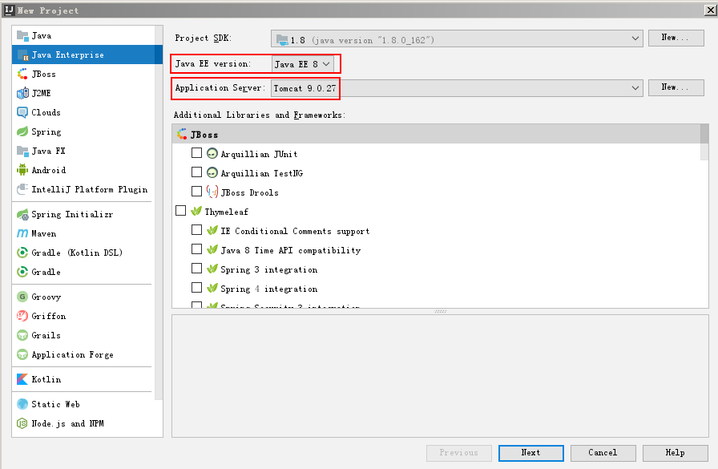
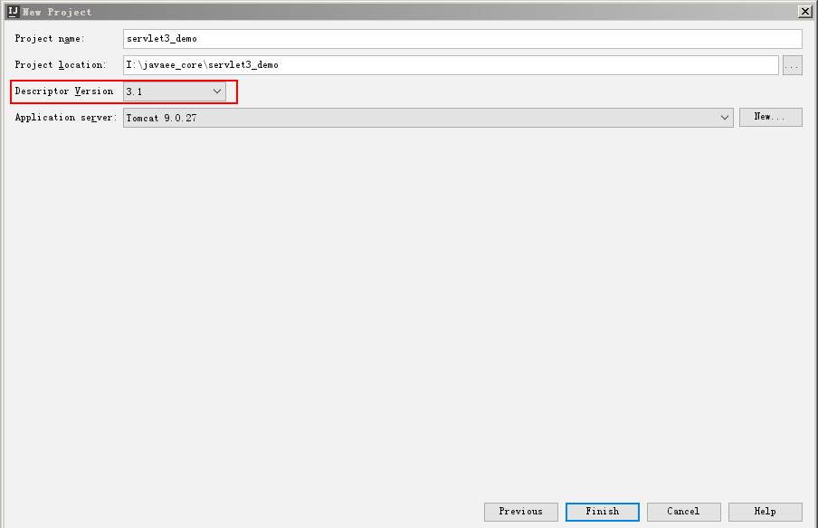
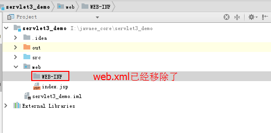
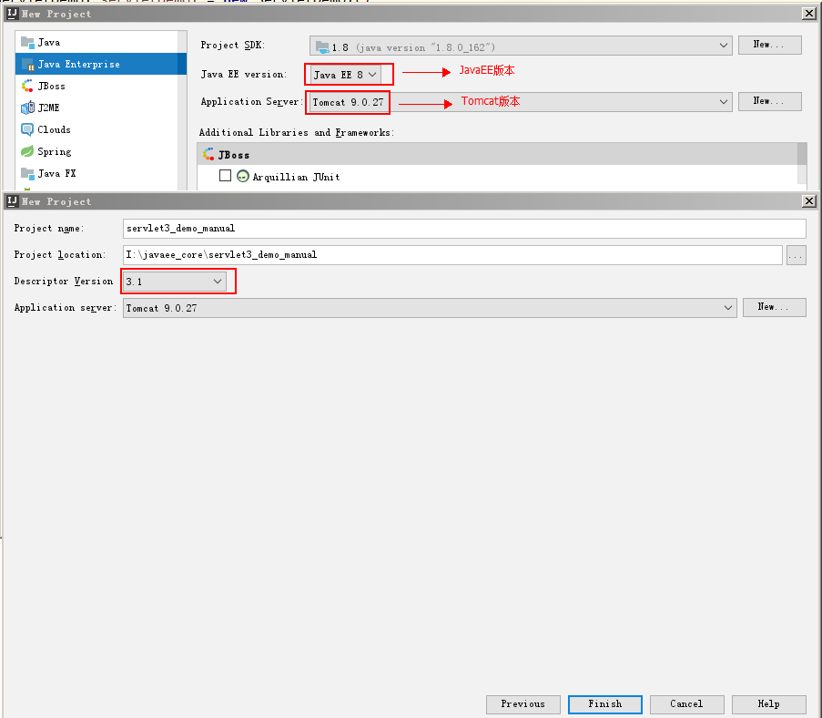
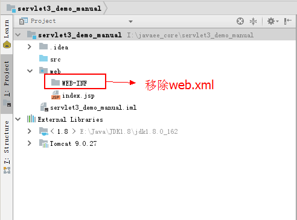
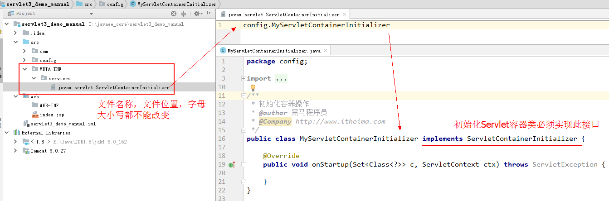
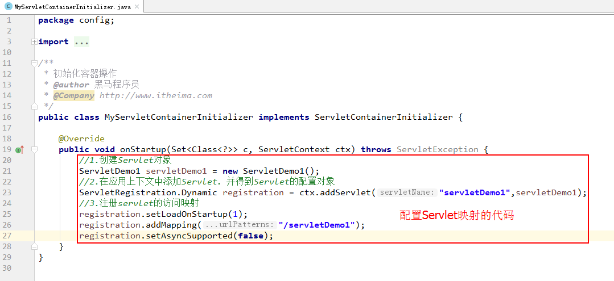
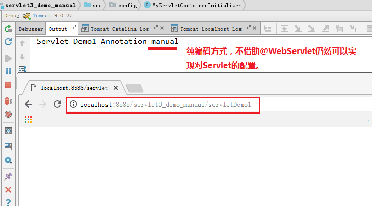

# 4 注解开发Servlet

## 4.1 Servlet3.0规范

首先，我们要先跟同学们明确一件事情，我们在《Tomcat和HTTP协议》课程中已经介绍了，我们使用的是Tomcat9，JavaEE规范要求是8，对应的Servlet规范规范应该是JavaEE8包含的4.x版本。

但是，同学们要知道，在企业级应用的开发中，稳定远比追新版本重要的多。所以，我们虽然用到了Tomcat9和对应的JavaEE8，但是涉及的Servlet规范我们降板使用，用的是Servlet3.1版本。关于兼容性问题，同学们也无须担心，向下兼容的特性，在这里也依然适用。

接下来，同学还有可能疑惑的地方就是，我们课程中明明使用的是Servlet3.1版本的规范，但是却总听老师提Servlet3.0规范，这两个到底有怎样的联系呢？

现在就给同学们解惑，在大概十多年前，那会还是Servlet2.5的版本的天下，它最明显的特征就是Servlet的配置要求配在web.xml中，<b><font color='red'>我们今天课程中在第4章节《注解开发Servlet》之前，全都是基于Servlet2.5规范编写的。</font></b>从2007年开始到2009年底，在这个时间段，软件开发开始逐步的演变，基于注解的配置理念开始逐渐出现，大量注解配置思想开始用于各种框架的设计中，例如：Spring3.0版本的Java Based Configuration，JPA规范，apache旗下的struts2和mybatis的注解配置开发等等。

JavaEE6规范也是在这个期间设计并推出的，与之对应就是它里面包含了新的Servlet规范：<b><font color='red'>Servlet3.0版本！</font></b>

## 4.2 注解开发入门案例

### 4.2.1 自动注解配置

#### 1）配置步骤

**第一步：创建JavaWeb工程，并移除web.xml**







**第二步：编写Servlet**

```java
/**
 * 注解开发Servlet
 */
public class Servlet注解 extends HttpServlet {
    @Override
    protected void doGet(HttpServletRequest req, HttpServletResponse resp) throws ServletException, IOException {
        System.out.println("程序执行了");   
    }

    @Override
    protected void doPost(HttpServletRequest req, HttpServletResponse resp) throws ServletException, IOException {
        doPost(req, resp);
    }
}
```

**第三步：使用注解配置Servlet**

```

```


**第四步：测试**


#### 2）注解详解

```java
/**
 * WebServlet注解
 * @since Servlet 3.0 (Section 8.1.1)
 */
@Target(ElementType.TYPE)
@Retention(RetentionPolicy.RUNTIME)
@Documented
public @interface WebServlet {

    /**
     * 指定Servlet的名称。
     * 相当于xml配置中<servlet>标签下的<servlet-name>
     */
    String name() default "";

    /**
     * 用于映射Servlet访问的url映射
     * 相当于xml配置时的<url-pattern>
     */
    String[] value() default {};

    /**
     * 相当于xml配置时的<url-pattern>
     */
    String[] urlPatterns() default {};

    /**
     * 用于配置Servlet的启动时机
     * 相当于xml配置的<load-on-startup>
     */
    int loadOnStartup() default -1;

    /**
     * 用于配置Servlet的初始化参数
     * 相当于xml配置的<init-param>
     */
    WebInitParam[] initParams() default {};

    /**
     * 用于配置Servlet是否支持异步
     * 相当于xml配置的<async-supported>
     */
    boolean asyncSupported() default false;

    /**
     * 用于指定Servlet的小图标
     */
    String smallIcon() default "";

    /**
     * 用于指定Servlet的大图标
     */
    String largeIcon() default "";

    /**
     * 用于指定Servlet的描述信息
     */
    String description() default "";

    /**
     * 用于指定Servlet的显示名称
     */
    String displayName() default "";
}
```

### 4.2.2 手动创建容器

#### 1）前置说明

在使用Servlet3.1版本的规范时，脱离了web.xml进行注解开发，它除了支持使用注解的配置方式外，还支持纯手动创建Servlet容器的方式。要想使用的话，必须遵循它的编写规范。它是从Servlet3.0规范才开始引入的，加入了一个新的接口：

```java
package javax.servlet;

import java.util.Set;

/**
 * 初始化Servlet容器必须实现此接口
 * 它是Servlet3.0规范提供的标准接口
 * @since Servlet 3.0
 */
public interface ServletContainerInitializer {
     /**
     * 启动容器时做一些初始化操作，例如注册Servlet,Filter,Listener等等。
 	 * @since Servlet 3.0
     */
    void onStartup(Set<Class<?>> c, ServletContext ctx) throws ServletException;
}
```

同时可以利用@HandlesTypes注解，把要加载到onStartup方法中的类字节码传入进来，@HandlesTypes源码如下：

```java
/**
 * 用于指定要加载到ServletContainerInitializer接口实现了中的字节码
 * @see javax.servlet.ServletContainerInitializer
 * @since Servlet 3.0
 */
@Target({ElementType.TYPE})
@Retention(RetentionPolicy.RUNTIME)
public @interface HandlesTypes {

    /**
     * 指定要加载到ServletContainerInitializer实现类的onStartUp方法中类的字节码。
     * 字节码可以是接口，抽象类或者普通类。
     */
    Class[] value();
}
```

#### 2）编写步骤

**第一步：创建工程，并移除web.xml**





**第二步：编写Servlet**

```java
/**
 * 注解开发Servlet 之 手动初始化容器
 * @author 黑马程序员
 * @Company http://www.itheima.com
 */
public class ServletDemo1 extends HttpServlet {

    @Override
    protected void doGet(HttpServletRequest req, HttpServletResponse resp) throws ServletException, IOException {
        doPost(req,resp);
    }

    @Override
    protected void doPost(HttpServletRequest req, HttpServletResponse resp) throws ServletException, IOException {
        System.out.println("Servlet Demo1 Annotation manual");
    }
}
```

**第三步：创建初始化容器的类，并按照要求配置**

```java
/**
 * 初始化容器操作
 * @author 黑马程序员
 * @Company http://www.itheima.com
 */
public class MyServletContainerInitializer implements ServletContainerInitializer {

    @Override
    public void onStartup(Set<Class<?>> c, ServletContext ctx) throws ServletException {
       
    }
}
```

在脱离web.xml时，要求在src目录下包含一个META-INF目录，位置和及字母都不能改变，且严格区分大小写。在目录中创建一个名称为`javax.servlet.ServletContainerInitializer`的文件，里面写实现了`ServletContainerInitializer`接口的全限定类名。如下图所示：



**第四步：编写注册Servlet的代码**



**第五步：测试**



# 5 Servlet应用案例-学生管理系统

## 5.1 案例介绍

### 5.1.1 案例需求

在昨天的课程讲解中，我们用Tomcat服务器替代了SE阶段的学生管理系统中自己写的服务器。今后我们进入企业肯定也会使用成型的产品，而不会自己去写服务器（除非是专门做应用服务器的公司）。

从今天开始案例正式进入了编码阶段，它是延续了JavaSE阶段课程的学生管理系统。并且分析了SE中系统的各类问题，在JavaWeb阶段学习，就是要通过每天的学习，逐步解决SE阶段学生管理系统中的遗留问题。

今天，我们将会去解决下面这个问题：<b><font color='red'>保存学生</font></b>。也就是让数据真正的动起来，本质就是通过html发送一个请求，把表单中填写的数据带到服务器端。因为每个使用者在表单填写的内容不一样，所有最终存起来的也就不一样了。

### 5.1.2 技术选型

这是一个全新的案例，而不是在SE阶段的案例上进行改造。所以我们用项目的方式来去约束这个案例。

任何一个项目，在立项之初都会有技术选型，也就是定义使用的技术集，这里面包含很多。例如：表现层技术，持久层技术，数据库技术等等。

我们今天只针对表现层进行编码，所以就先来定义表现层技术。表现层技术的选型就是Servlet+HTML的组合。

由HTML中编写表单，Servlet中定义接收请求的方法，最终把表单数据输出到控制台即可。<b>我们Servlet的配置方式仍然选择基于web.xml的配置方式。</b>
