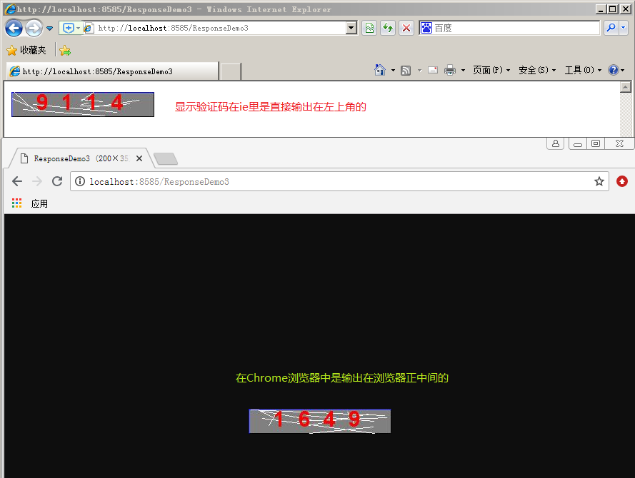

# Response

# 1 响应对象

## 1.1 响应对象概述

### 1.1.1 关于响应

响应，它表示了服务器端收到请求，同时也已经处理完成，把处理的结果告知用户。简单来说，指的就是服务器把请求的处理结果告知客户端。在B/S架构中，响应就是把结果带回浏览器。

响应对象，顾名思义就是用于在JavaWeb工程中实现上述功能的对象。

### 1.1.2 常用响应对象

响应对象也是是Servlet规范中定义的，它包括了协议无关的和协议相关的。

协议无关的对象标准是：ServletResponse接口

协议相关的对象标准是：HttpServletResponse接口

类结构图如下：


我们课程中涉及的响应对象都是和HTTP协议相关的。即使用的是HttpServletResponse接口的实现类。

这里有些同学可能会产生疑问，我们在使用Servlet时，需要定义一个类，然后实现Servlet接口（或者继承它的实现类）。现在我们想要实现响应功能，要不要定义一个类，然后实现HttpServletResponse接口呢？

<b>此问题的答案是否定的，我们无需这么做。</b>我们只需要在自己写的Servlet中直接使用即可，因为这个对象的实现类是由Tomcat提供的，无须我们自定义。同时它还会帮我们把对象创建出来并传入doGet和doPost方法中。

## 1.2 常用方法介绍 

在HttpServletResponse接口中提供了很多方法，接下来我们通过API文档，来了解一下这些方法。


常用状态码：

| 状态码 |                            说明                            |
| :----: | :--------------------------------------------------------: |
|  200   |                          执行成功                          |
|  302   | 它和307一样，都是用于重定向的状态码。只是307目前已不再使用 |
|  304   |                 请求资源未改变，使用缓存。                 |
|  400   |            请求错误。最常见的就是请求参数有问题            |
|  404   |                       请求资源未找到                       |
|  405   |                      请求方式不被支持                      |
|  500   |                     服务器运行内部错误                     |

状态码首位含义：

| 状态码 |    说明    |
| :----: | :--------: |
|  1xx   |    消息    |
|  2xx   |    成功    |
|  3xx   |   重定向   |
|  4xx   | 客户端错误 |
|  5xx   | 服务器错误 |

## 1.3 响应对象的使用示例

### 1.3.1 响应-字节流及乱码问题


```java
/**
 * @author 黑马程序员
 * @Company http://www.itheima.com
 */
public class ResponseDemo1 extends HttpServlet {

    /**
     * 演示字节流输出的乱码问题
     */
    public void doGet(HttpServletRequest request, HttpServletResponse response)
            throws ServletException, IOException {
        /**
         * 问题：
         * 	  String str = "字节流中文乱码问题";
         * 	     使用字节流输出，会不会产生中文乱码？
         * 答案：
         * 	  会产生乱码
         * 原因：
         * 	String str = "字节流中文乱码问题"; 在保存时用的是IDEA创建文件使用的字符集UTF-8。
         * 	到浏览器上显示，chrome浏览器和ie浏览器默认的字符集是GB2312(其实就是GBK)，存和取用的不是同一个码表，就会产生乱码。
         *
         * 引申：
         *   如果产生了乱码，就是存和取用的不是同一个码表
         * 解决办法：
         *   把存和取的码表统一。
         */
        String str = "字节流输出中文的乱码问题";//UTF-8的字符集，此时浏览器显示也需要使用UTF-8的字符集。
        //1.拿到字节流输出对象
        ServletOutputStream sos = response.getOutputStream();
        /**
         * 解决办法：
         *  第1种解决办法：
         * 		设置响应消息头，告知浏览器响应正文的MIME类型和字符集
         * 		response.setHeader("Content-Type","text/html;charset=UTF-8");
         * 	第2种解决办法：我们推荐使用的办法
         * 	    它的本质就是设置了一个响应消息头
         *  	response.setContentType("text/html;charset=UTF-8");
         */
  
        //第三种解决办法：
      	//response.setHeader("Content-Type","text/html;charset=UTF-8");
        //第四种解决办法：
        response.setContentType("text/html;charset=UTF-8");
        //2.把str转换成字节数组之后输出到浏览器
        sos.write(str.getBytes("UTF-8")); 
    }

    public void doPost(HttpServletRequest request, HttpServletResponse response)
            throws ServletException, IOException {
        doGet(request, response);
    }
}
```


### 1.3.2 响应-字符流及乱码问题


```java
/**
 * @author 黑马程序员
 * @Company http://www.itheima.com
 */
public class ResponseDemo2 extends HttpServlet {

    /**
     * 字符流输出中文乱码
     * @param request
     * @param response
     * @throws ServletException
     * @throws IOException
     */
    public void doGet(HttpServletRequest request, HttpServletResponse response)
            throws ServletException, IOException {
        String str = "字符流输出中文乱码";
        //response.setCharacterEncoding("UTF-8");

        //设置响应正文的MIME类型和字符集
        response.setContentType("text/html;charset=UTF-8");
        //1.获取字符输出流
        PrintWriter out = response.getWriter();
        //2.使用字符流输出中文
        /**
         * 问题：
         * 	out.write(str); 直接输出，会不会产生乱码
         * 答案：
         * 	会产生乱码
         * 原因：
         * 	存用的什么码表：UTF-8
         *  在浏览器取之前，字符流PrintWriter已经获取过一次了，PrintWriter它在取的时候出现了乱码。
         * 	浏览器取默认用的是GBK。（本地系统字符集）
         *
         *  UTF-8(存)————>PrintWriter ISO-8859-1(取)					乱
         *  PrintWirter ISO-8859-1(存)————>浏览器 GBK(取)				乱
         *
         * 解决办法：
         * 	改变PrintWriter的字符集，PrintWriter是从response对象中获取的，其实设置response的字符集。
         *  注意：设置response的字符集，需要在拿流之前。
         *  response.setCharacterEncoding("UTF-8");
         *
         * response.setContentType("text/html;charset=UTF-8");
         * 此方法，其实是做了两件事：
         * 		1.设置响应对象的字符集（包括响应对象取出的字符输出流）
         * 		2.告知浏览器响应正文的MIME类型和字符集
         */

        out.write(str);
    }

    public void doPost(HttpServletRequest request, HttpServletResponse response)
            throws ServletException, IOException {
        doGet(request, response);
    }
}
```


### 1.3.3 响应-图片

```
@WebServlet("/responseDemo3")
public class ResponseDemo3 extends HttpServlet {
    @Override
    protected void doGet(HttpServletRequest req, HttpServletResponse resp) throws ServletException, IOException {
        //通过图片的相对路径获取绝对路径
        String realPath = getServletContext().getRealPath("/img/dd.png");

        //读取图片
        BufferedInputStream bis = new BufferedInputStream(new FileInputStream(realPath));
        //获取相应输出流
        ServletOutputStream os = resp.getOutputStream();

        int len;
        byte[] b = new byte[1024];
        while((len = bis.read(b))!=-1){
            os.write(b,0,len);
        }
        bis.close();
    }

    @Override
    protected void doPost(HttpServletRequest req, HttpServletResponse resp) throws ServletException, IOException {
        doPost(req, resp);
    }
}
```


### 1.3.4 响应-生成验证码


```java
/**
 * @author 黑马程序员
 * @Company http://www.itheima.com
 *
 */
public class ResponseDemo3 extends HttpServlet {

    /**
     * 输出图片
     * @param request
     * @param response
     * @throws ServletException
     * @throws IOException
     */
    public void doGet(HttpServletRequest request, HttpServletResponse response)
            throws ServletException, IOException {
        int width = 200;
        int height = 35;
        /**
         * 实现步骤:
         * 	1.创建图像内存对象
         *  2.拿到画笔
         *  3.设置颜色，画矩形边框
         *  4.设置颜色，填充矩形
         *  5.设置颜色，画干扰线
         *  6.设置颜色，画验证码
         *  7.把内存图像输出到浏览器上
         */
        //创建内存图像
        BufferedImage image = new BufferedImage(width,height,BufferedImage.TYPE_INT_RGB);//参数：宽度，高度 （指的都是像素），使用的格式（RGB）
        Graphics g = image.getGraphics();//画笔就一根

        //设置颜色
        g.setColor(Color.BLUE);
        //画边框
        g.drawRect(0, 0, width, height);

        //设置颜色
        g.setColor(Color.GRAY);
        //填充矩形
        g.fillRect(1, 1, width-2, height-2);

        //设置颜色
        g.setColor(Color.WHITE);
        //拿随机数对象
        Random r = new Random();
        //画干扰线 10条
        for(int i=0;i<10;i++){
            g.drawLine(r.nextInt(width), r.nextInt(height),r.nextInt(width), r.nextInt(height));
        }

        //设置颜色
        g.setColor(Color.RED);
        //改变字体大小
        Font font = new Font("宋体", Font.BOLD,30);//参数：1字体名称。2.字体样式 3.字体大小
        g.setFont(font);//设置字体
        //画验证码	4个
        int x = 35;//第一个数的横坐标是35像素
        for(int i=0;i<4;i++){
            //r.nextInt(10)+""这种写法效率是十分低的
            g.drawString(String.valueOf(r.nextInt(10)), x, 25);
            x+=35;
        }

        //输出到浏览器上
        //参数： 1.内存对象。2.输出的图片格式。3.使用的输出流
        ImageIO.write(image, "jpg", response.getOutputStream());
    }

    public void doPost(HttpServletRequest request, HttpServletResponse response)
            throws ServletException, IOException {
        doGet(request, response);
    }

}
```



### 1.3.5 设置响应消息头-控制缓存


```java
/**
 * 设置缓存时间
 * 	使用缓存的一般都是静态资源
 *  动态资源一般不能缓存。
 *  我们现在目前只掌握了Servlet，所以用Servlet做演示
 * @author 黑马程序员
 * @Company http://www.itheima.com
 *
 */
public class ResponseDemo4 extends HttpServlet {

    public void doGet(HttpServletRequest request, HttpServletResponse response)
            throws ServletException, IOException {
        String str = "设置缓存时间";
        /*
         * 设置缓存时间，其实就是设置响应消息头：Expires 但是值是一个毫秒数。
         * 使用的是
         * 	response.setDateHeader();
         *
         * 缓存1小时，是在当前时间的毫秒数上加上1小时之后的毫秒值
         */
        response.setDateHeader("Expires",System.currentTimeMillis()+1*60*60*1000);
        response.setContentType("text/html;charset=UTF-8");
        response.getOutputStream().write(str.getBytes());
    }

    public void doPost(HttpServletRequest request, HttpServletResponse response)
            throws ServletException, IOException {
        doGet(request, response);
    }

}
```


### 1.3.6 设置响应消息头定时刷新


```java
/**
 * 设置响应消息头：
 * 通过定时刷新演示添加消息头
 * @author 黑马程序员
 * @Company http://www.itheima.com
 *
 */
public class ResponseDemo5 extends HttpServlet {

    public void doGet(HttpServletRequest request, HttpServletResponse response)
            throws ServletException, IOException {
        String str = "用户名和密码不匹配，2秒后转向登录页面...";
        response.setContentType("text/html;charset=UTF-8");
        PrintWriter out = response.getWriter();
        out.write(str);
        //定时刷新，其实就是设置一个响应消息头
        response.setHeader("Refresh", "2;URL=/login.html");//Refresh设置的时间单位是秒，如果刷新到其他地址，需要在时间后面拼接上地址
    }

    public void doPost(HttpServletRequest request, HttpServletResponse response)
            throws ServletException, IOException {
        doGet(request, response);
    }

}
```


### 1.3.7 请求重定向

请求重定向：客户端的一次请求到达后，发现需要借助其他Servlet来实现功能

特点：

浏览器地址栏会发生改变

两次请求，请求域对象中不能共享数据

可以重定向到其他服务器


重定向原理：

设置响应状态码为302：resp.setStatus(302)

设置响应的资源路径(响应到哪去，通过响应消息头location来指定)

resp.setHeader("location","/response/responseDemo07")

路径为虚拟路径+访问路径


重定向方法：

| 返回值 | 方法名                    | 说明       |
| ------ | ------------------------- | ---------- |
| void   | sendRedirect(String name) | 设置重定向 |


```java
/**
 * 设置响应状态码，实现重定向
 * 重定向的特点：
 * 	 两次请求，地址栏改变，浏览器行为，xxxx
 * @author 黑马程序员
 * @Company http://www.itheima.com
 *
 */
public class ResponseDemo6 extends HttpServlet {

    public void doGet(HttpServletRequest request, HttpServletResponse response)
            throws ServletException, IOException {
        //1.设置响应状态码
//		response.setStatus(302);
        //2.定向到哪里去: 其实就是设置响应消息头，Location
//		response.setHeader("Location", "ResponseDemo7");

        //使用重定向方法
        response.sendRedirect("ResponseDemo7");//此行做了什么事，请看上面
    }

    public void doPost(HttpServletRequest request, HttpServletResponse response)
            throws ServletException, IOException {
        doGet(request, response);
    }

}
```

```java
/**
 * 重定向的目的地
 * @author 黑马程序员
 * @Company http://www.itheima.com
 */
public class ResponseDemo7 extends HttpServlet {

    public void doGet(HttpServletRequest request, HttpServletResponse response)
            throws ServletException, IOException {
        response.getWriter().write("welcome to ResponseDemo7");
    }

    public void doPost(HttpServletRequest request, HttpServletResponse response)
            throws ServletException, IOException {
        doGet(request, response);
    }

}
```


### 1.3.8 响应和消息头组合应用-文件下载

首先，在工程的web目录下新建一个目录uploads，并且拷贝一张图片到目录中，如下图所示：


文件下载的Servlet代码如下：

```java
/**
 * 文件下载
 * @author 黑马程序员
 * @Company http://www.itheima.com
 *
 */
public class ResponseDemo8 extends HttpServlet {

    public void doGet(HttpServletRequest request, HttpServletResponse response)
            throws ServletException, IOException {
        /*
         * 文件下载的思路：
         * 		1.获取文件路径
         * 		2.把文件读到字节输入流中
         * 		3.告知浏览器，以下载的方式打开（告知浏览器下载文件的MIME类型）
         * 		4.使用响应对象的字节输出流输出到浏览器上
         */
        //1.获取文件路径（绝对路径）
        ServletContext context = this.getServletContext();
        String filePath = context.getRealPath("/uploads/6.jpg");//通过文件的虚拟路径，获取文件的绝对路径
        //2.通过文件路径构建一个字节输入流
        InputStream in  = new FileInputStream(filePath);
        //3.设置响应消息头
        /*
            Content-Type 消息头名称   支持的类型
            application/octet-stream   消息头参数  应用类型为字节流
         */
        response.setHeader("Content-Type", "application/octet-stream");
        //告知浏览器以下载的方式打开
      	/*
            Content-Disposition  消息头名称  处理的形式
            attachment;filename=  消息头参数  附件形式进行处理  指定下载文件名称
         */
        response.setHeader("Content-Disposition", "attachment;filename=1.jpg");
        //4.使用响应对象的字节输出流输出
        OutputStream out = response.getOutputStream();
        int len = 0;
        byte[] by = new byte[1024];
        while((len = in.read(by)) != -1){
            out.write(by, 0, len);
        }
        in.close();
    }

    public void doPost(HttpServletRequest request, HttpServletResponse response)
            throws ServletException, IOException {
        doGet(request, response);
    }

}
```


### 1.3.9 响应对象注意事项

**第一： response得到的字符流和字节流互斥，只能选其一**

**第二：response获取的流不用关闭，由服务器关闭即可**

```java
/**
 * 使用Response对象获取流时候的注意事项：
 * 	1.我们使用response获取的流，可以不用关闭。服务器会给我们关闭。
 * 	2.在response对象中，字节流和字符流互斥，输出的时候，只能选择一个
 * @author zhy
 *
 */
public class ResponseDemo9 extends HttpServlet {

    public void doGet(HttpServletRequest request, HttpServletResponse response)
            throws ServletException, IOException {
        String str = "test";
        response.getOutputStream().write(str.getBytes());
        //response.getWriter().write(str);
//		response.getOutputStream().write("haha".getBytes());

    }

    public void doPost(HttpServletRequest request, HttpServletResponse response)
            throws ServletException, IOException {
        doGet(request, response);
    }

}s
```


