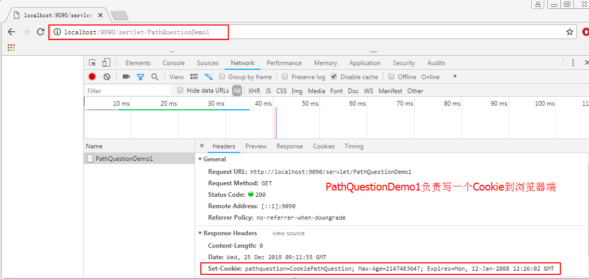
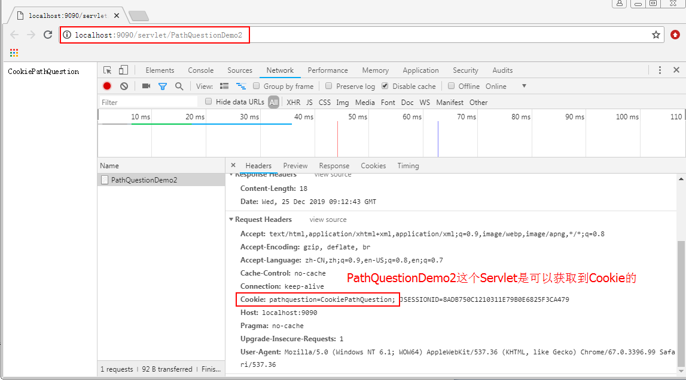
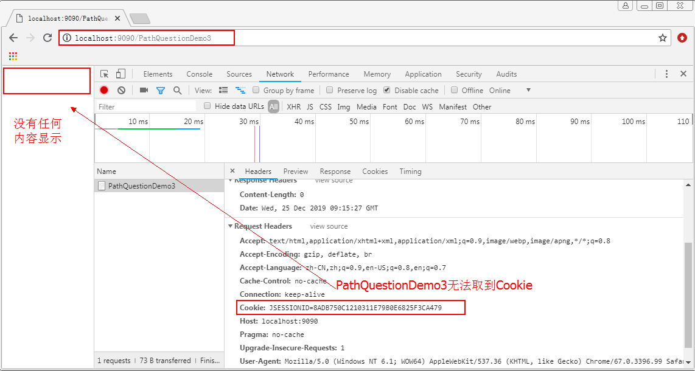
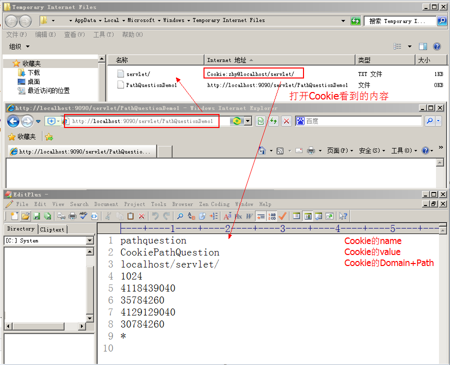
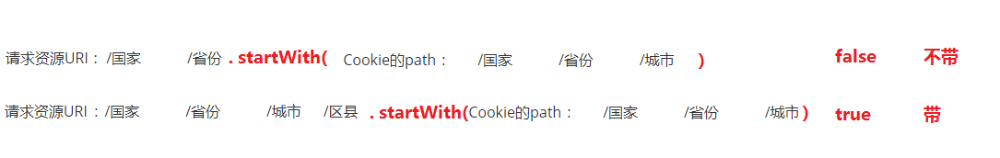

# Cookie&SessionJsp-授课

# 1 会话技术

## 1.1 会话管理概述

### 1.1.1 什么是会话

这里的会话，指的是web开发中的一次通话过程，当打开浏览器，访问网站地址后，会话开始，当关闭浏览器（或者到了过期时间），会话结束。

举个例子：

​	例如，你在给家人打电话，这时突然有送快递的配送员敲门，你放下电话去开门，收完快递回来后，通话还在保持中，继续说话就行了。

### 1.1.2 会话管理作用

什么时候会用到会话管理呢？最常见的就是购物车，当我们登录成功后，把商品加入到购物车之中，此时我们无论再浏览什么商品，当点击购物车时，那些加入的商品都仍在购物车中。

在我们的实际开发中，还有很多地方都离不开会话管理技术。比如，我们在论坛发帖，没有登录的游客身份是不允许发帖的。所以当我们登录成功后，无论我们进入哪个版块发帖，只要权限允许的情况下，服务器都会认识我们，从而让我们发帖，因为登录成功的信息一直保留在服务器端的会话中。

通过上面的两个例子，我们可以看出，它是为我们共享数据用的，并且是在不同请求间实现数据共享。也就是说，如果我们需要在多次请求间实现数据共享，就可以考虑使用会话管理技术了。

### 1.1.3 会话管理分类

在JavaEE的项目中，会话管理分为两类。分别是：客户端会话管理技术和服务端会话管理技术。

**客户端会话管理技术**

​		它是把要共享的数据保存到了客户端（也就是浏览器端）。每次请求时，把会话信息带到服务器，从而实现多次请求的数据共享。

**服务端会话管理技术**

​		它本质仍是采用客户端会话管理技术，只不过保存到客户端的是一个特殊的标识，并且把要共享的数据保存到了服务端的内存对象中。每次请求时，把这个标识带到服务器端，然后使用这个标识，找到对应的内存空间，从而实现数据共享。

## 1.2 客户端会话管理技术

### 1.2.1 Cookie概述

#### 1）什么是Cookie

它是客户端浏览器的缓存文件，里面记录了客户浏览器访问网站的一些内容。同时，也是HTTP协议请求和响应消息头的一部分（在HTTP协议课程中，我们备注了它很重要）。

#### 2）Cookie的API详解

**作用**

它可以保存客户浏览器访问网站的相关内容（需要客户端不禁用Cookie）。从而在每次访问需要同一个内容时，先从本地缓存获取，使资源共享，提高效率。

**Cookie的属性**

| 属性名称 | 属性作用                 | 是否重要 |
| -------- | ------------------------ | -------- |
| name     | cookie的名称             | 必要属性 |
| value    | cookie的值（不能是中文） | 必要属性 |
| path     | cookie的路径             | 重要     |
| domain   | cookie的域名             | 重要     |
| maxAge   | cookie的生存时间。       | 重要     |
| version  | cookie的版本号。         | 不重要   |
| comment  | cookie的说明。           | 不重要   |


#### 3）Cookie涉及的常用方法


向浏览器添加Cookie**

```java
/**
 * 添加Cookie到响应中。此方法可以多次调用，用以添加多个Cookie。
 */
public void addCookie(Cookie cookie);
```

**从服务器端获取Cookie**

```java
/**
 * 这是HttpServletRequest中的方法。
 * 它返回一个Cookie的数组，包含客户端随此请求发送的所有Cookie对象。
 * 如果没有符合规则的cookie，则此方法返回null。
 */
 public Cookie[] getCookies();
```

#### 4）Cookie的使用

**需求说明** 

通过 Cookie记录最后访问时间，并在浏览器上显示出来。

**最终目的** 

掌握 Cookie的基本使用，从创建到添加客户端，再到从服务器端获取。

**实现步骤** 

1.通过响应对象写出一个提示信息。 

2.创建 Cookie对象，指定name和 value。 

3.设置 Cookie 最大存活时间。 

4.通过响应对象将Cookie对象添加到客户端。

 5.通过请求对象获取Cookie对象。

 6.将Cookie 对象中的访问时间写出。

```
@WebServlet("/cookieDemo1")
public class CookieDemo1 extends HttpServlet {
    @Override
    protected void doGet(HttpServletRequest req, HttpServletResponse resp) throws ServletException, IOException {
        //设置编码，解决乱码问题
        resp.setContentType("text/html;charset=utf-8");
        //1.通过响应对象写出一个提示信息。
        PrintWriter pw = resp.getWriter();
        pw.write("欢迎访问本网站，你最后的访问时间为：<br>");
        //2.创建 Cookie对象，指定name和 value。
        Cookie cookie = new Cookie("time",System.currentTimeMillis()+"");
        //3.设置 Cookie 最大存活时间。
        cookie.setMaxAge(3600);
        //4.通过响应对象将Cookie对象添加到客户端。
        resp.addCookie(cookie);
        //5.通过请求对象获取Cookie对象。
        Cookie[] cookies = req.getCookies();
        //6.获取cookie，遍历Cookie对象。
        for(Cookie c:cookies){
            if ("time".equals(c.getName())){
                String value = c.getValue();
                System.out.println(value);
                SimpleDateFormat sdf = new SimpleDateFormat("yyyy-MM-dd HH:mm:ss");
                String format = sdf.format(new Date(Long.parseLong(value)));
                System.out.println(format);
                pw.write(format);
            }
        }
    }
    @Override
    protected void doPost(HttpServletRequest req, HttpServletResponse resp) throws ServletException, IOException {
        doPost(req, resp);
    }
```


## 1.3 cookie使用**细节**

##### 1) Cookie有大小，个数限制

每个网站最多只能存20个cookie，且大小不能超过4kb。同时，所有网站的cookie总数不超过300个。

##### 2) 存活时间限制

setMaxAge()方法接收数字：

1、负整数：当前会话有效，浏览器关闭则清除

2、0：立即清除

3、正整数：以秒为单位设置存活时间

##### 3)路径

访问路径限制：

默认路径：取自第一次访问的资源路径前缀，只要以这个路径开头就能访问到

设置路径：setPath()方法设置指定路径


1）需求说明

创建一个Cookie，设置Cookie的path，通过不同的路径访问，从而查看请求携带Cookie的情况。

2）案例目的

通过此案例的讲解，同学们可以清晰的描述出，客户浏览器何时带cookie到服务器端，何时不带。

3）案例步骤

**第一步：创建JavaWeb工程**

沿用第一个案例中的工程即可。

**第二步：编写Servlet**

```JAVA
/**
 * Cookie的路径问题
 * 前期准备：
 * 	1.在demo1中写一个cookie到客户端
 *  2.在demo2和demo3中分别去获取cookie
 *  	demo1的Servlet映射是   /servlet/PathQuestionDemo1
 *  	demo2的Servlet映射是   /servlet/PathQuestionDemo2
 *  	demo3的Servlet映射是   /PathQuestionDemo3
 *
 * @author 黑马程序员
 * @Company http://www.itheima.com
 *
 */
public class PathQuestionDemo1 extends HttpServlet {

	public void doGet(HttpServletRequest request, HttpServletResponse response)
			throws ServletException, IOException {
		//1.创建一个Cookie
		Cookie cookie = new Cookie("pathquestion","CookiePathQuestion");
		//2.设置cookie的最大存活时间
		cookie.setMaxAge(Integer.MAX_VALUE);
		//3.把cookie发送到客户端
		response.addCookie(cookie);//setHeader("Set-Cookie","cookie的值")
	}

	public void doPost(HttpServletRequest request, HttpServletResponse response)
			throws ServletException, IOException {
		doGet(request, response);
	}
}

```

```java
/**
 * 获取Cookie，名称是pathquestion
 * @author 黑马程序员
 * @Company http://www.itheima.com
 */
public class PathQuestionDemo2 extends HttpServlet {

	public void doGet(HttpServletRequest request, HttpServletResponse response)
			throws ServletException, IOException {
		//1.获取所有的cookie
		Cookie[] cs = request.getCookies();
		//2.遍历cookie的数组
		for(int i=0;cs!=null && i<cs.length;i++){
			if("pathquestion".equals(cs[i].getName())){
				//找到了我们想要的cookie，输出cookie的值
				response.getWriter().write(cs[i].getValue());
				return;
			}
		}
	}

	public void doPost(HttpServletRequest request, HttpServletResponse response)
			throws ServletException, IOException {
		doGet(request, response);
	}
}
```

```java
/**
 * 获取Cookie，名称是pathquestion
 * @author 黑马程序员
 * @Company http://www.itheima.com
 */
public class PathQuestionDemo3 extends HttpServlet {

	public void doGet(HttpServletRequest request, HttpServletResponse response)
			throws ServletException, IOException {
		//1.获取所有的cookie
		Cookie[] cs = request.getCookies();
		//2.遍历cookie的数组
		for(int i=0;cs!=null && i<cs.length;i++){
			if("pathquestion".equals(cs[i].getName())){
				//找到了我们想要的cookie，输出cookie的值
				response.getWriter().write(cs[i].getValue());
				return;
			}
		}
	}

	public void doPost(HttpServletRequest request, HttpServletResponse response)
			throws ServletException, IOException {
		doGet(request, response);
	}
}
```

**第三步：配置Servlet**

```xml
<!--配置Cookie路径问题案例的Servlet-->
<servlet>
    <servlet-name>PathQuestionDemo1</servlet-name>
    <servlet-class>com.itheima.web.servlet.pathquestion.PathQuestionDemo1</servlet-class>
</servlet>
<servlet-mapping>
    <servlet-name>PathQuestionDemo1</servlet-name>
    <url-pattern>/servlet/PathQuestionDemo1</url-pattern>
</servlet-mapping>

<servlet>
    <servlet-name>PathQuestionDemo2</servlet-name>
    <servlet-class>com.itheima.web.servlet.pathquestion.PathQuestionDemo2</servlet-class>
</servlet>
<servlet-mapping>
    <servlet-name>PathQuestionDemo2</servlet-name>
    <url-pattern>/servlet/PathQuestionDemo2</url-pattern>
</servlet-mapping>

<servlet>
    <servlet-name>PathQuestionDemo3</servlet-name>
    <servlet-class>com.itheima.web.servlet.pathquestion.PathQuestionDemo3</servlet-class>
</servlet>
<servlet-mapping>
    <servlet-name>PathQuestionDemo3</servlet-name>
    <url-pattern>/PathQuestionDemo3</url-pattern>
</servlet-mapping>
```

**第四步：部署工程**

沿用第一个案例中的工程部署即可。

4）测试结果

通过分别运行PathQuestionDemo1，2和3这3个Servlet，我们发现由demo1写Cookie，在demo2中可以取到，但是到了demo3中就无法获取了，如下图所示：







5）路径问题的分析及总结

**问题：**
 	 demo2和demo3谁能取到cookie？
 **答案：**
 	 demo2能取到，demo3取不到
**分析：**
 	 首先，我们要知道如何确定一个cookie？
 	 那就是使用cookie的三个属性组合：<font color='red'><b>domain+path+name</b></font>
 	 这里面，同一个应用的domain是一样的，在我们的案例中都是localhost。
​      并且，我们取的都是同一个cookie，所以name也是一样的，都是pathquestion。
​      那么，不一样的只能是path了。但是我们没有设置过cookie的path属性，这就表明path是有默认值的。
 	 接下来，我们打开这个cookie来看一看，在ie浏览器访问一次PathQuestionDemo1这个Servlet：

Cookie中的内容：
 		 
 我们是通过demo1写的cookie，demo1的访问路径是： http://localhost:9090/servlet/PathQuestionDemo1
 通过比较两个路径：请求资源地址和cookie的path，可以看出：cookie的path默认值是：请求资源URI，没有资源的部分（在我们的案例中，就是没有PathQuestionDemo1）。

**客户端什么时候带cookie到服务器，什么时候不带？**
​	就是看请求资源URI和cookie的path比较。

​	<font color='red'>请求资源URI.startWith(cookie的path) </font> 如果返回的是true就带，如果返回的是false就不带。

​	简单的说： 就是看谁的地址更精细

​	比如：Cookie的path：       /国家			/省份			/城市

 		 	 请求资源URI	:   	  /国家			/省份														  不带
 		 	 请求资源URI   ：	   /国家			/省份			/城市			/区县				带



在我们的案例中：

| 访问URL                                                      | URI部分                    | Cookie的Path | 是否携带Cookie | 能否取到Cookie |
| ------------------------------------------------------------ | -------------------------- | ------------ | -------------- | -------------- |
| [PathQuestionDemo2](http://localhost:9090/servlet/PathQuestionDemo2) | /servlet/PathQuestionDemo2 | /servlet/    | 带             | 能取到         |
| [PathQuestionDemo3](http://localhost:9090/PathQuestionDemo3) | /PathQuestionDemo3         | /servlet/    | 不带           | 不能取到       |

