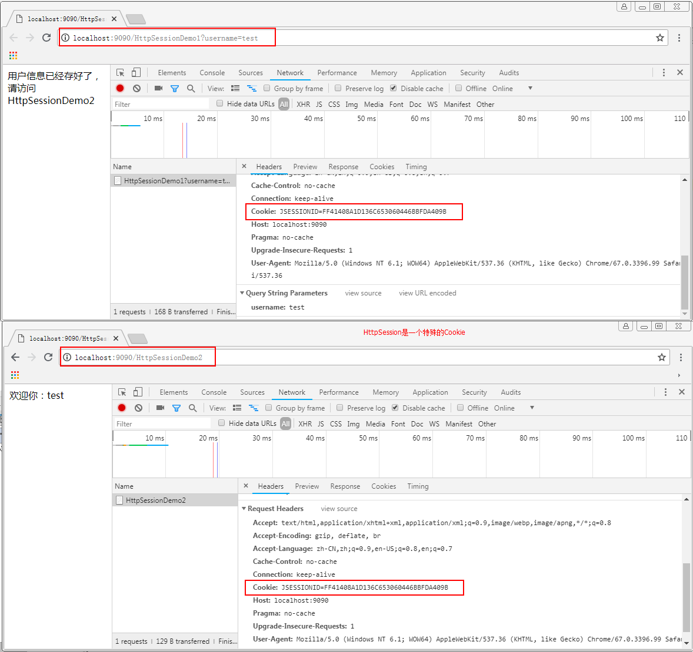

# Session

## 1.3 服务端会话管理概述

### 1.3.1 HttpSession概述

#### 1）HttpSession对象介绍

HttpSession：服务器端会话管理技术

本质也是采用客户端会话管理技术

只不过在客户端保存的是一个特殊标识，而共享的数据保存到了服务器端的内存对象中

每次请求时会将特殊标识带到服务器端，根据这个标识来找到对应的内存空间，从而实现数据共享

是servlet规范中四大域对象之一的会话域对象

作用：可以实现数据共享

同时，它也是Servlet规范中四大域对象之一的会话域对象。并且它也是用于实现数据共享的。但它与我们之前讲解的应用域和请求域是有区别的。

| 域对象         | 作用范围 | 使用场景                                                     |
| -------------- | -------- | ------------------------------------------------------------ |
| ServletContext | 应用域   | 在整个应用之间实现数据共享                                   |
| ServletRequest | 请求域   | 在当前的请求或请求转发之间实现数据共享                       |
| HttpSession    | 会话域   | 在当前会话范围中实现数据共享。它可以在多次请求中实现数据共享。 |

#### 2）HttpSession的获取

| 返回值      | 方法名                     | 说明                                      |
| ----------- | -------------------------- | ----------------------------------------- |
| HttpSession | getSession()               | 获取HttpSession对象                       |
| HttpSession | getSession(boolean create) | 获取HttpSession对象，未获取时是否自动创建 |

#### 3）HttpSession的常用方法


### 1.3.2 HttpSession的使用


#### 1）需求说明

通过第一个servlet设置共享数据用户名，并在第二个Servlet获取到

#### 2）案例目的

通过本案例的讲解，同学们可以清楚的认识到会话域的作用，即多次请求间的数据共享。因为是两次请求，请求域肯定不一样了，所以不能用请求域实现。

最终掌握HttpSession对象的获取和使用。

#### 3）实现步骤

1、在第一个Servlet中获取请求的用户名

2、获取HttpSession对象

3、将用户名设置到共享数据中

```
public class SessionDemo01 extends HttpServlet {
    @Override
    protected void doPost(HttpServletRequest req, HttpServletResponse resp) throws ServletException, IOException {
        //1、在第一个Servlet中获取请求的用户名
        String username = req.getParameter("username");
        //2、获取HttpSession对象
        HttpSession session = req.getSession();
        //3、将用户名设置到共享数据中
        session.setAttribute("username",username);
    }

    @Override
    protected void doGet(HttpServletRequest req, HttpServletResponse resp) throws ServletException, IOException {
        super.doGet(req, resp);
    }
}
```

4、在第二个Servlet中获取HttpSession对象

5、获取共享数据用户名

6、将获取到用户名响应给客户端浏览器

```
@WebServlet("/sessionDemo02")
public class SessionDemo02 extends HttpServlet {
    @Override
    protected void doGet(HttpServletRequest req, HttpServletResponse resp) throws ServletException, IOException {
        //4、在第二个Servlet中获取HttpSession对象
        HttpSession session = req.getSession();
        //5、获取共享数据用户名
        Object username = session.getAttribute("username");
        //6、将获取到用户名响应给客户端浏览器
        resp.getWriter().write(username+"");
    }

    @Override
    protected void doPost(HttpServletRequest req, HttpServletResponse resp) throws ServletException, IOException {
        doPost(req, resp);
    }
}
```


#### 4）原理分析

HttpSession，它虽然是服务端会话管理技术的对象，但它本质仍是一个Cookie。是一个由服务器自动创建的特殊的Cookie，Cookie的名称就是JSESSIONID，Cookie的值是服务器分配的一个唯一的标识。

当我们使用HttpSession时，浏览器在没有禁用Cookie的情况下，都会把这个Cookie带到服务器端，然后根据唯一标识去查找对应的HttpSession对象，找到了，我们就可以直接使用了。下图就是我们入门案例中，HttpSession分配的唯一标识，同学们可以看到两次请求的JSESSIONID的值是一样的：



### 1.3.3 HttpSession的钝化和活化

**什么是持久态**

​		把长时间不用，但还不到过期时间的HttpSession进行序列化，写到磁盘上。

​		我们把HttpSession持久态也叫做钝化。（与钝化相反的，我们叫活化。）

**什么时候使用持久化**

​		第一种情况：当访问量很大时，服务器会根据getLastAccessTime来进行排序，对长时间不用，但是还没到过期时间的HttpSession进行持久化。

​		第二种情况：当服务器进行重启的时候，为了保持客户HttpSession中的数据，也要对HttpSession进行持久化

**注意**

​		HttpSession的持久化由服务器来负责管理，我们不用关心。

​		只有实现了序列化接口的类才能被序列化，否则不行。

