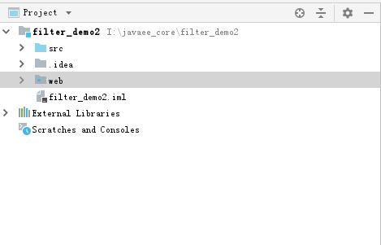
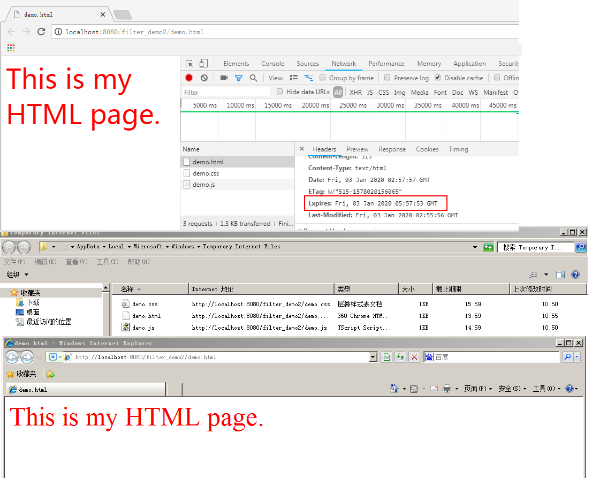
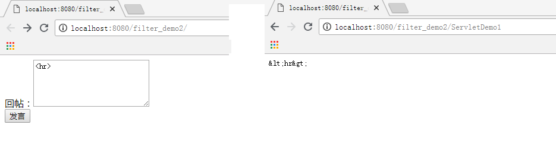

# 2 Servlet规范中的过滤器-Filter

## 2.1 过滤器入门

### 2.1.1 过滤器概念及作用

过滤器——Filter，它是JavaWeb三大组件之一。另外两个是Servlet和Listener。

它是在2000年发布的Servlet2.3规范中加入的一个接口。是Servlet规范中非常实用的技术。

它可以对web应用中的所有资源进行拦截，并且在拦截之后进行一些特殊的操作。

常见应用场景：URL级别的权限控制；过滤敏感词汇；中文乱码问题等等。


Filter是一个接口，如果想实现过滤器的功能，必须实现该接口

核心方法

| 返回值 | 方法名                                                       | 作用                     |
| ------ | ------------------------------------------------------------ | ------------------------ |
| void   | init(FilterConfig config)                                    | 初始化方法               |
| void   | doFilter(ServletRequest request,ServletResponse response,FilterChain chain) | 对请求资源和响应资源过滤 |
| void   | destroy()                                                    | 销毁方法                 |


FilterChain

过滤器链对象

FilterChain是一个由servlet容器提供给开发人员的对象，它无需我们自己定义，直接使用即可。

它提供了对过滤器链式调用的调用链视图。也就是说过滤器支持多个，多个过滤器组成过滤器链	

过滤器使用本接口中的doFilter方法调用链中的下一个过滤器，如果当前过滤器处于过滤器链的最后一个，它就会调用目标资源(最终资源)。

注意:	

本接口中的doFilter和Filter接口中的doFilter不一样，也不是同一个。本接口中的doFilter只有两个参数，调用此方法的含义表明是放行。

| 返回值 | 方法                                                      | 作用                                                         |
| ------ | --------------------------------------------------------- | ------------------------------------------------------------ |
| void   | doFilter(ServletRequestrequest, ServletResponse response) | **放行方法，含义是:如果有下一个过滤器，则调用下一个过滤器;如果当前过滤器处于过滤器链中的最后一个，则调用目标资源。** |


### 2.1.2 过滤器的入门案例

需求说明

通过 Filter过滤器解决多个资源写出中文乱码的问题。

最终目的

通过本需求，最终掌握Filter过滤器的使用。

实现步骤

1.创建一个web项目。

2.创建两个Servlet功能类，都向客户端写出中文数据。

3.创建一个Filter过滤器实现类，重写doFilter核心方法。

4.在方法内解决中文乱码，并放行。

5.部署并启动项目。

6.通过浏览器测试。


创建两个Servlet功能类，都向客户端写出中文数据

```java
/**
 * 用于接收和处理请求的Servlet
 * @author 黑马程序员
 * @Company http://www.itheima.com
 */
@WebServlet("/servletDemo01")
public class ServletDemo01 extends HttpServlet {
    @Override
    protected void doGet(HttpServletRequest req, HttpServletResponse resp) throws ServletException, IOException {
        System.out.println("ServletDemo01执行了。。。");
        resp.getWriter().write("ServletDemo01执行了。。。");
    }

    @Override
    protected void doPost(HttpServletRequest req, HttpServletResponse resp) throws ServletException, IOException {
        super.doPost(req, resp);
    }
}

```

```
@WebServlet("/servletDemo02")
public class ServletDemo01 extends HttpServlet {
    @Override
    protected void doGet(HttpServletRequest req, HttpServletResponse resp) throws ServletException, IOException {
        System.out.println("ServletDemo02执行了。。。");
        resp.getWriter().write("ServletDemo02执行了。。。");
    }

    @Override
    protected void doPost(HttpServletRequest req, HttpServletResponse resp) throws ServletException, IOException {
        super.doPost(req, resp);
    }
}

```


#### 2）过滤器的编写步骤

**编写过滤器**-注解形式

```java
@WebFilter("/*")
public class FilterDemo01 implements Filter {
    @Override
    public void doFilter(ServletRequest servletRequest, ServletResponse servletResponse, FilterChain filterChain) throws IOException, ServletException {
        System.out.println("filterDemo01执行了。。。");

        servletResponse.setContentType("text/html;charset=UTF-8");

        filterChain.doFilter(servletRequest,servletResponse);
    }
}

```


## 2.2 过滤器的细节

### 2.2.1 配置方式

1）注解形式@WebFilter("/*")

2）配置文件

```xml
<!--配置过滤器-->
<filter>
    <filter-name>FilterDemo1</filter-name>
    <filter-class>com.itheima.web.filter.FilterDemo1</filter-class>
</filter>
<filter-mapping>
    <filter-name>FilterDemo1</filter-name>
    <url-pattern>/*</url-pattern>
</filter-mapping>
```

### 2.2.2 过滤器使用顺序

1)多个过滤器使用顺序

<font color='red'><b>`<filter-mapping>`的配置前后顺序决定过滤器的调用顺序，也就是由映射配置顺序决定。</b></font>


### 2.2.3 入门案例过程及生命周期

#### 1）生命周期

**出生——活着——死亡**

创建

当应用加载时实例化对象并执行init初始化方法

服务

对象提供服务的过程，执行doFilter方法

销毁

当应用卸载时或服务器停止时对象销毁，执行destroy方法

#### 2）FilterConfig

FilterConfig是一个接口，代表过滤器的配置对象，可以加载一些初始化参数

核心方法

| 返回值              | 方法                    | 作用               |
| ------------------- | ----------------------- | ------------------ |
| String              | getFilterNane ()        | 获取过滤器对象名称 |
| String              | getInitParaneter()      | 根据key获取value   |
| Enumeration<String) | getInitParameterNames() | 获取所有参数的key  |
| ServletCentext      | getServletContext()     | 获取应用上下文对象 |

```
<filter>
	<filter-name>filterDemo02</filter-name>
	<filter-class>com.itheima.filter.FilterDemo02</filter-class>
	<init-param>
		<param-name>initParamName</param-name>
		<paramvalue>initParamValue</param-value>
	</init-param>
</filter>
<filter-mapping>
	<filter-name>filterDemo02</filter-name>
	<url-pattem>/*</url-pattem>
</filter-mapping>
```

```
public class FilterDemo02 implements Filter {

    @Override
    public void init(FilterConfig filterConfig) throws ServletException {
        System.out.println("filterDemo02初始化完成");

        String filterName = filterConfig.getFilterName();
        System.out.println(filterName);

        String initParameter = filterConfig.getInitParameter("username");
        System.out.println(initParameter);
    }

    @Override
    public void doFilter(ServletRequest servletRequest, ServletResponse servletResponse, FilterChain filterChain) throws IOException, ServletException {
        System.out.println("filterDemo02执行了。。。");

        servletResponse.setContentType("text/html;charset=UTF-8");

        filterChain.doFilter(servletRequest,servletResponse);
    }
}
```


### 2.2.4 过滤器的五种拦截行为

我们的过滤器目前拦截的是请求，但是在实际开发中，我们还有请求转发和请求包含，以及由服务器触发调用的全局错误页面。默认情况下过滤器是不参与过滤的，要想使用，需要我们配置。配置的方式如下：

```xml
<!--配置过滤器-->
<filter>
    <filter-name>FilterDemo1</filter-name>
    <filter-class>com.itheima.web.filter.FilterDemo1</filter-class>
    <!--配置开启异步支持，当dispatcher配置ASYNC时，需要配置此行-->
    <async-supported>true</async-supported>
</filter>
<filter-mapping>
    <filter-name>FilterDemo1</filter-name>
    <url-pattern>/ServletDemo1</url-pattern>
    <!--过滤请求：默认值。-->
    <dispatcher>REQUEST</dispatcher>
    <!--过滤全局错误页面：当由服务器调用全局错误页面时，过滤器工作-->
    <dispatcher>ERROR</dispatcher>
    <!--过滤请求转发：当请求转发时，过滤器工作。-->
    <dispatcher>FORWARD</dispatcher>
    <!--过滤请求包含：当请求包含时，过滤器工作。它只能过滤动态包含，jsp的include指令是静态包含-->
    <dispatcher>INCLUDE</dispatcher>
    <!--过滤异步类型，它要求我们在filter标签中配置开启异步支持-->
    <dispatcher>ASYNC</dispatcher>
</filter-mapping>
```

### 2.2.5 过滤器与Servlet的区别

| 方法/类型                                          | Servlet                                                      | Filter                                                       | 备注                                                         |
| -------------------------------------------------- | ------------------------------------------------------------ | ------------------------------------------------------------ | ------------------------------------------------------------ |
| 初始化                                        方法 | `void   init(ServletConfig);   `                             | `void init(FilterConfig);   `                                | 几乎一样，都是在web.xml中配置参数，用该对象的方法可以获取到。 |
| 提供服务方法                                       | `void   service(request,response);                                               ` | `void   dofilter(request,response,FilterChain);                                   ` | Filter比Servlet多了一个FilterChain，它不仅能完成Servlet的功能，而且还可以决定程序是否能继续执行。所以过滤器比Servlet更为强大。   在Struts2中，核心控制器就是一个过滤器。 |
| 销毁方法                                           | `void destroy();`                                            | `void destroy();`                                            |                                                              |

## 2.3 过滤器的使用案例

### 2.3.1 静态资源设置缓存时间过滤器

#### 1） 需求说明

在我们访问html，js，image时，不需要每次都重新发送请求读取资源，就可以通过设置响应消息头的方式，设置缓存时间。但是如果每个Servlet都编写相同的代码，显然不符合我们统一调用和维护的理念。（此处有个非常重要的编程思想：AOP思想，在录制视频时提不提都可以）

因此，我们要采用过滤器来实现功能。

#### 2） 编写步骤

**第一步：创建JavaWeb工程**



**第二步：导入静态资源**


**第三步：编写过滤器**

```java
/**
 * 静态资源设置缓存时间
 * 	html设置为1小时
 *  js设置为2小时
 *  css设置为3小时
 * @author 黑马程序员
 * @Company http://www.itheima.com
 */
public class StaticResourceNeedCacheFilter implements Filter {

    private FilterConfig filterConfig;

    public void init(FilterConfig filterConfig) throws ServletException {
        this.filterConfig = filterConfig;
    }


    public void doFilter(ServletRequest req, ServletResponse res,
                         FilterChain chain) throws IOException, ServletException {
        //1.把doFilter的请求和响应对象转换成跟http协议有关的对象
        HttpServletRequest  request;
        HttpServletResponse response;
        try {
            request = (HttpServletRequest) req;
            response = (HttpServletResponse) res;
        } catch (ClassCastException e) {
            throw new ServletException("non-HTTP request or response");
        }
        //2.获取请求资源URI
        String uri = request.getRequestURI();
        //3.得到请求资源到底是什么类型
        String extend = uri.substring(uri.lastIndexOf(".")+1);//我们只需要判断它是不是html,css,js。其他的不管
        //4.判断到底是什么类型的资源
        long time = 60*60*1000;
        if("html".equals(extend)){
            //html 缓存1小时
            String html = filterConfig.getInitParameter("html");
            time = time*Long.parseLong(html);
        }else if("js".equals(extend)){
            //js 缓存2小时
            String js = filterConfig.getInitParameter("js");
            time = time*Long.parseLong(js);
        }else if("css".equals(extend)){
            //css 缓存3小时
            String css = filterConfig.getInitParameter("css");
            time = time*Long.parseLong(css);

        }
        //5.设置响应消息头
        response.setDateHeader("Expires", System.currentTimeMillis()+time);
        //6.放行
        chain.doFilter(request, response);
    }


    public void destroy() {

    }

}
```

**第四步：配置过滤器**

```xml
<filter>
    <filter-name>StaticResourceNeedCacheFilter</filter-name>
    <filter-class>com.itheima.web.filter.StaticResourceNeedCacheFilter</filter-class>
    <init-param>
        <param-name>html</param-name>
        <param-value>3</param-value>
    </init-param>
    <init-param>
        <param-name>js</param-name>
        <param-value>4</param-value>
    </init-param>
    <init-param>
        <param-name>css</param-name>
        <param-value>5</param-value>
    </init-param>
</filter>
<filter-mapping>
    <filter-name>StaticResourceNeedCacheFilter</filter-name>
    <url-pattern>*.html</url-pattern>
</filter-mapping>
<filter-mapping>
    <filter-name>StaticResourceNeedCacheFilter</filter-name>
    <url-pattern>*.js</url-pattern>
</filter-mapping>
<filter-mapping>
    <filter-name>StaticResourceNeedCacheFilter</filter-name>
    <url-pattern>*.css</url-pattern>
</filter-mapping>
```

#### 3） 测试结果

> 此案例演示时需要注意一下，chrome浏览器刷新时，每次也都会发送请求，所以看不到304状态码。建议用IE浏览器，因为它在刷新时不会再次请求。



### 2.3.2 特殊字符过滤器

#### 1）需求说明

在实际开发中，可能会面临一个问题，就是很多输入框都会遇到特殊字符。此时，我们也可以通过过滤器来解决。

例如：

​	我们模拟一个论坛，有人发帖问：“在HTML中表示水平线的标签是哪个？”。

如果我们在文本框中直接输入`<hr/>`就会出现一条水平线，这个会让发帖人一脸懵。

我们接下来就用过滤器来解决一下。

#### 2）编写步骤

**第一步：创建JavaWeb工程**

沿用第一个案例的工程

**第二步：编写Servlet和JSP**

```java
/**
 * @author 黑马程序员
 * @Company http://www.itheima.com
 */
public class ServletDemo1 extends HttpServlet {

    public void doGet(HttpServletRequest request, HttpServletResponse response)
            throws ServletException, IOException {
        String content = request.getParameter("content");
        response.getWriter().write(content);
    }

    public void doPost(HttpServletRequest request, HttpServletResponse response)
            throws ServletException, IOException {
        doGet(request, response);
    }

}
```

```jsp
<servlet>
    <servlet-name>ServletDemo1</servlet-name>
    <servlet-class>com.itheima.web.servlet.ServletDemo1</servlet-class>
</servlet>
<servlet-mapping>
    <servlet-name>ServletDemo1</servlet-name>
    <url-pattern>/ServletDemo1</url-pattern>
</servlet-mapping>
```

```jsp
<%@ page language="java" import="java.util.*" pageEncoding="UTF-8"%>
<!DOCTYPE HTML PUBLIC "-//W3C//DTD HTML 4.01 Transitional//EN">
<html>
<head>
    <title></title>
</head>
<body>
<form action="${pageContext.request.contextPath}/ServletDemo1" method="POST">
    回帖：<textarea rows="5" cols="25" name="content"></textarea><br/>
    <input type="submit" value="发言">
</form>
</body>
</html>
```

**第三步：编写过滤器**

```java

/**
 * @author 黑马程序员
 * @Company http://www.itheima.com
 */
public class HTMLFilter implements Filter {

    public void init(FilterConfig filterConfig) throws ServletException {

    }


    public void doFilter(ServletRequest req, ServletResponse res,
                         FilterChain chain) throws IOException, ServletException {
        HttpServletRequest request;
        HttpServletResponse response;
        try {
            request = (HttpServletRequest) req;
            response = (HttpServletResponse) res;
        } catch (ClassCastException e) {
            throw new ServletException("non-HTTP request or response");
        }
        //创建一个自己的Request类
        MyHttpServletRequest2 myrequest = new MyHttpServletRequest2(request);
        //放行：
        chain.doFilter(myrequest, response);
    }

    public void destroy() {
    }
}
class MyHttpServletRequest2 extends HttpServletRequestWrapper {
    //提供一个构造方法
    public MyHttpServletRequest2(HttpServletRequest request){
        super(request);
    }

    //重写getParameter方法
    public String getParameter(String name) {
        //1.获取出请求正文： 调用父类的获取方法
        String value = super.getParameter(name);
        //2.判断value是否有值
        if(value == null){
            return null;
        }
        return htmlfilter(value);
    }

    private String htmlfilter(String message){
        if (message == null)
            return (null);

        char content[] = new char[message.length()];
        message.getChars(0, message.length(), content, 0);
        StringBuilder result = new StringBuilder(content.length + 50);
        for (int i = 0; i < content.length; i++) {
            switch (content[i]) {
                case '<':
                    result.append("&lt;");
                    break;
                case '>':
                    result.append("&gt;");
                    break;
                case '&':
                    result.append("&amp;");
                    break;
                case '"':
                    result.append("&quot;");
                    break;
                default:
                    result.append(content[i]);
            }
        }
        return (result.toString());
    }

}
```

**第四步：配置过滤器**

```xml
<filter>
    <filter-name>HTMLFilter</filter-name>
    <filter-class>com.itheima.web.filter.HTMLFilter</filter-class>
</filter>
<filter-mapping>
    <filter-name>HTMLFilter</filter-name>
    <url-pattern>/*</url-pattern>
</filter-mapping>
```

#### 3）测试结果



